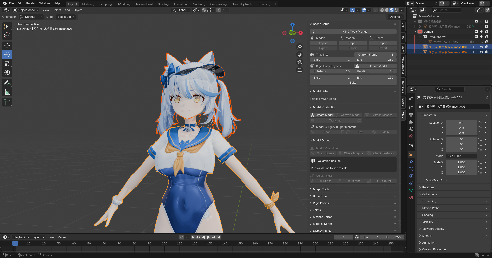
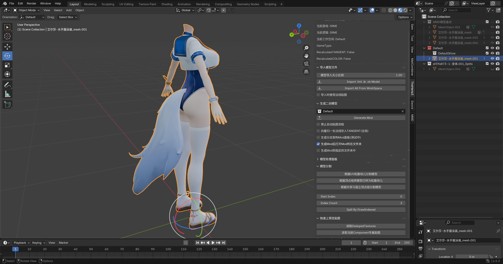
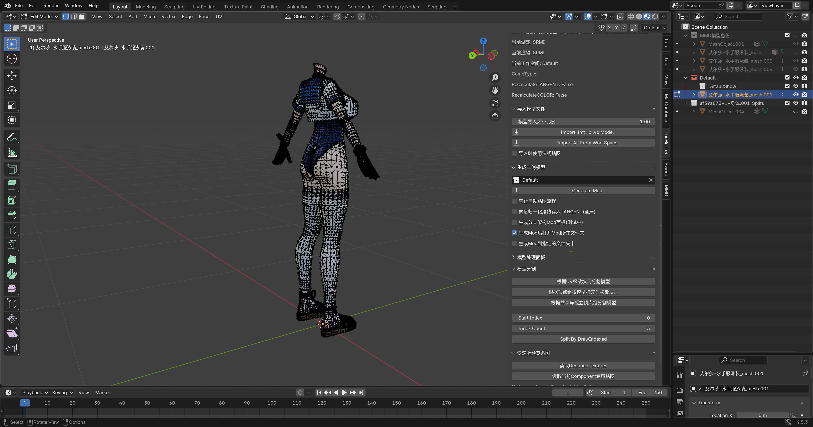

# 💃 将MMD模型转为Mod流程

因为 新手 做 Mod 时，大部分都不会自己建模，所以这里用获取最方便的 MMD模型 来举例。

::: tip 💡 哪里找模型？
可以在 **模之屋** 找个模型跟练：[https://www.aplaybox.com/](https://www.aplaybox.com/)
:::

我们在实际制作的过程中，用什么模型都是可以的，所以制作 Mod 的前提是你熟练掌握 Blender 的模型处理技巧。

::: info ⏳ 时间分配
在大多数情况下，SSMT 与 TheHerta 在整个 Mod 制作过程中，只能占用你 **1%** 不到的时间。
在你熟练使用 SSMT 流程之后，**99%** 的时间都会花在 Blender 中。
:::

## 📦 准备好模型

模型下载完成之后打开里面一般会有 `.pmx` 格式的模型：

## 🧩 确保已安装MMD插件

目前我使用的是 Blender 4.5LTS 版本，已经安装了 MMD插件：

::: warning ⚠️ 注意
在开始下一步之前，确保你安装好了 MMD插件。
:::

## 📥 导入MMD模型

点击这个导入按钮，来导入 MMD模型。

选中模型后，点击 **导入**。

可以看到导入成功了！🎉

## 🗑️ 移除joints和rigidbodies

导入后可以看到 MMD模型 有俩我们制作 Mod 用不到的东西。

右键把它们 Delete Hierarchy (删除层级)。

删除后如下，清爽多了：

## 📏 调整整体大小

MMD模型 得选中这个坐标系图标一样的 **最外层的东西**，然后切换到 Scale (缩放) 模式，调整大小。

调整到和游戏 原模型 差不多大小就行了，确保 **肩膀** 的位置大概对上。

::: tip 🧠 灵活变通
这一步注意要 **随机应变**，因为不是所有的游戏模型都是标准的 MMD体型。
:::

随后点击 `Object` => `Apply` => `All Transforms`。

应用完成后，删除这个坐标系。

此时只剩下 **骨架** 和 **模型** 了：

## 🧘 姿态对齐

选中 **骨架**，进入 **姿态模式**，进入 **旋转模式**。

旋转右边的胳膊到和游戏 原模型 差不多的角度：

旋转完成后，右键选择 MMD Flip Pose。

这样左边的胳膊也就跟着对齐了，是不是很神奇？✨

如此这般，进行一系列 **缩放** 和 **旋转** 操作，直到 MMD模型 和 原模型 基本对齐。

接下来切换到 **物体模式**，`Object` => `Apply` => `All Transforms`。

应用后，右侧属性变为基础状态：

选中 MMD的模型，打开右侧 **数据面板**：

删除最下面两个锁定的 **顶点组**，一般名为 `mmd_edge_scale` 和 `mmd_vertex_color`。

然后应用所有的 **形态键**。

切换到 **修改器**，然后把它应用掉：

随后删除 **骨架**，仅保留 MMD模型：

::: danger 🛑 关键步骤
这里我们 **必须** 再次 `Object` => `Apply` => `All Transforms`。
:::

使得右侧属性面板恢复默认：

接下来保存一下 `.blend` 文件，并将这个 MMD模型 复制一份放到一个集合里作为 **备份**。

准备好就开始后面的步骤吧！🚀

## ✂️ 分割模型

因为我们这里只修改身体，所以要把 MMD模型 的 **头部** 分割出来。

这里随便你怎么分割，一般都是在 **编辑模式** 中，一点一点的分割模型。

这里多了个尾巴，我们也要删掉：

然后把分割好的模型 **备份** 一份，准备开始后续的步骤：

## 🛠️ 原模型处理

接下来需要处理 原模型。

我们需要去掉裙子，以及边角料物件，因为我们现在做的这个泳装不需要做那些位置。

例如身上这些挂饰，因为具有额外的权重，所以要么删掉，要么分离并隐藏起来备用。

这里我偷懒，直接删掉了。😜

这里为了快速分割，我们使用 根据共享与孤立顶点组分割模型 这个功能：

出来一大堆分割开来的模型，我们把身体的主要部分组合在一起，小部件直接删掉：

先把身体主要部分隐藏，然后可以看到剩余的小部件：

把小部件删掉，隐藏的身体显示回来：

然后把身体碎片组合到一起，再手动删掉一些没有被分割出来的小部件，因为这个算法有时候不是太好用。

到这里 原模型 就处理完成了，记得 **备份** 一份，然后开始后面的步骤。

## 🏷️ 顶点组自动改名法

没错，我要开始 **偷懒** 了，你作为萌新，我建议你也先学会 **偷懒** 的方法。😴

所以我们直接从 **偷懒大法** 开始演示。

先分别选中两个模型，点击 移除未使用的空顶点组。

把处理好的两个模型都显示出来，然后按住 <kbd>Ctrl</kbd>，先选中 游戏原模型，再选中你的 MMD模型，**注意先后顺序哦**！

然后点击 将目标obj的顶点组按位置对应关系改名。

执行完成后，选中我们的 MMD模型，可以看到 **顶点组名称** 都被改过了：

此时我们需要删掉 MMD模型 的手部，使用 游戏原模型 的手作为手，偷懒省去刷手的权重。

以及脖子，直接偷懒用 原模型 的脖子，防止对不上脖子接缝。

::: tip 💡 经验之谈
反正你第一次做 Mod，能 **偷懒** 就 **偷懒**，能 **简化** 就 **简化**。
:::

## 🔗 合并模型

在合并 MMD模型 和 游戏原模型 之前，需要给 MMD模型 的 **UV** 改名。

改名为 `TEXCOORD.xy`。

随后合并到 游戏原模型 上：

## 🎨 合并贴图

此时打开 Material Combiner 插件（萌新偷懒法，懒得手动拼接了）。

点击 **Generate Material List**。

然后此时我们点击 **Save Atlas To**。

将合并的图片保存到桌面：

此时我们去 **UV** 里查看，就能看到它变成一张大图了：

虽然空间占用很难看，不过我们无所谓了，这就是 **偷懒的代价**。🤷‍♂️

## 🔢 处理顶点组顺序和数量

可以看到现在 **顶点组** 的顺序和数量都是不对的。

点击 **排序** 一下：

排序完成发现有很多 `.001` 什么的，现在我们 **移除一下未使用的顶点组**：

少了很多！

现在我们看一下 游戏原模型 一共有多少个 **顶点组**：

最大顶点组名称为 `198`，我们再看看我们处理好的模型有多少个顶点组？不够 `198` 的话，我们创建一个名为 `198` 的顶点组出来，如果够的话就不管了：

接下来点击 合并具有相同数字前缀名称的顶点组。

合并完成之后就没有 `.001` `.002` 这种的了：

然后我们先 **排序** 一下，然后再点击 填充数字顶点组的间隙。

可以看到 **顶点组** 是按顺序递增的了：

## 🚀 生成Mod

此时我们选中当前工作空间为名称的集合：

然后把我们的模型名称改为 **一键导入后的模型名称**，也就是它需要符合命名规则：

然后 **生成Mod**。

自动弹出生成好的 Mod 文件夹：

去游戏里查看效果：

可以看到模型差不多正确了，接下来就是 **贴图** 了。

## 🖼️ 上贴图

还记得我们之前的 **Save atlas to** 那个步骤吗，那会儿在桌面生成了一个贴图：

但是这玩意是 `PNG` 格式的贴图，需要转换成 `DDS` 格式。

我们需要先去 `Deduped` 文件夹中看看这个贴图的 `DDS` 格式是什么：

可以看到它是 `BC7_UNORM SRGB`。

我们现在要把这个 `PNG` 贴图使用 Paint.net 转为 `dds` 格式，点击 **文件**，**另存为**。

选择格式 `dds`。

弹出来的进一步选择格式，选择 `BC7 SRGB +`。

得到了 `dds` 贴图，虽然它有恐怖的 **144MB** 大小。😱

别急后面我们再优化贴图大小，作为萌新你先学会流程。

现在，我们去把这个贴图，替换为 Mod 文件夹中的 `Diffuse` 贴图：

打开生成的 Mod 文件夹中的 `Textures` 文件夹，然后把原本的 `diffuse` 贴图的名称复制到我们的贴图上，然后把原本的 `diffuse` 删掉或者改名。

游戏里 <kbd>F10</kbd> 刷新查看效果。

看起来不错，接下来我们还需要调整其它三个贴图，以确保效果都正确。

先把当前 `DiffuseMap` 直接复制三份出来，改名到对应的名称。

然后去 `DedupedTextures` 里查看每个贴图的格式，用 Paint.net 把每一个都另存为重新保存的方式来保证格式正确：

这里除了 `Diffuse` 之外，都是 `BC6H_UF16`，我们就选这个格式：

然后保存，但是由于之前 Material Combiner 合并贴图时，实在是太多贴图了，导致合并出来的贴图太大，导致现在保存直接卡死了。😵

所以本节内容到这里就结束了。

本节内容的篇幅实在是太长了，所以暂时完结，下一节内容中，我们将会详细说明贴图部分的技巧。

---

**📅 更新日期**: 2025年12月17日

::: warning ⚠️ 免责声明
本文档内容仅用于 **学习交流目的**，仅供参考。请勿将本文档内容用于任何 **商业目的**。作者不对因使用本文档内容而产生的任何后果承担责任。本文档部分内容由 **AI** 生成，仅供参考。
:::

