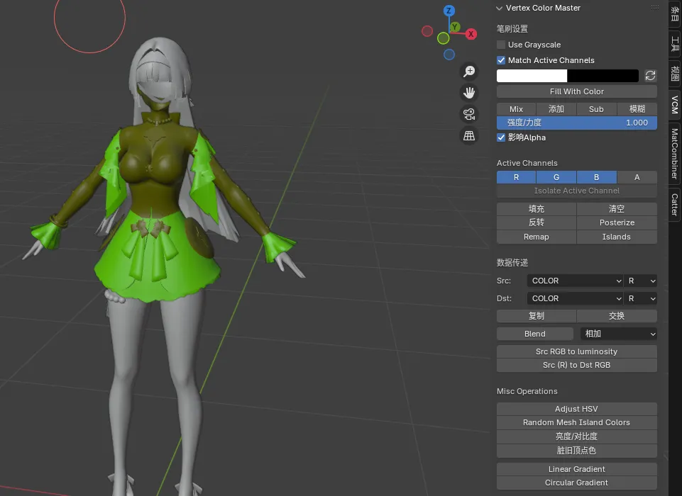
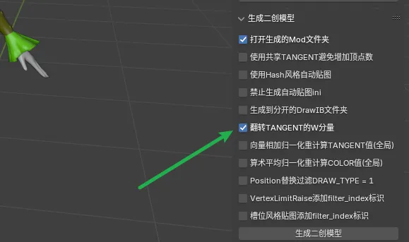
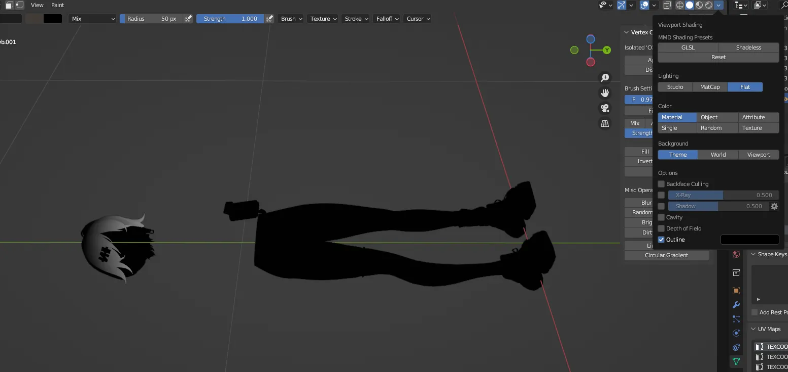
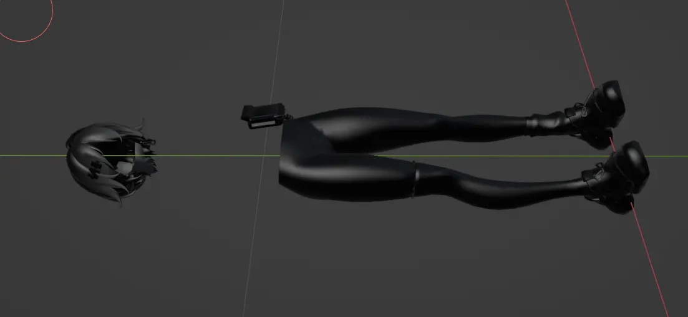
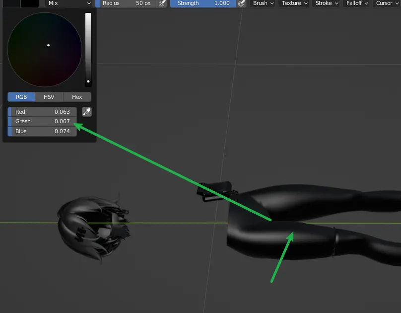
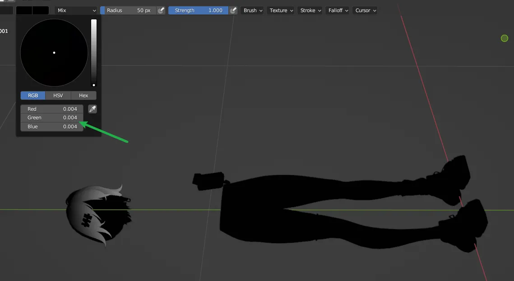
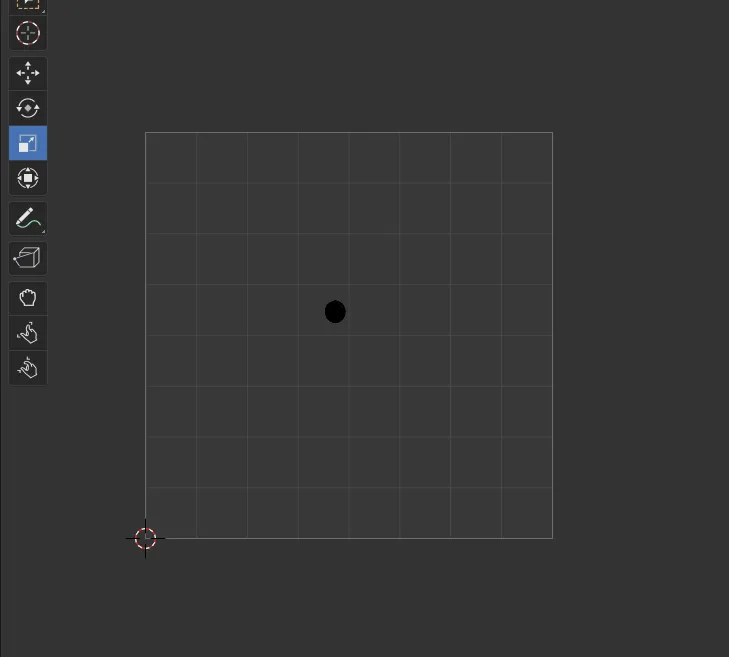
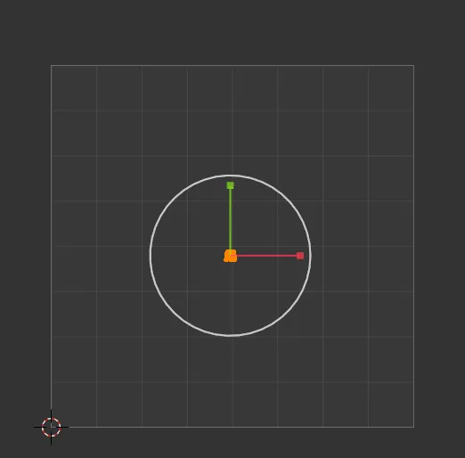

# 注意事项
- 使用VCM(Vertex Color Master)插件来手刷COLOR值，尽可能参考模型原本的COLOR值来刷，这样能获得更好的阴影和轮廓线。

# 必须：TANGENT的W分量翻转

- 勾选TANGENT分量翻转 W，可以获得游戏本身的阴影，也就是完美阴影。

# 必须：向量相加归一化算法冲计算TANGENT值

这里是全局控制，如果要精细控制，也可以右键：

# RGBA分量
在手刷COLOR值时，以下内容需要注意
# R通道
R通道控制的是轮廓线粗细0为没有，1为最粗，注意头发那里特别精细，要用渐变刷。

# G通道
G通道会影响轮廓线的显示朝向，越趋于0越往左，越趋于1越往右。

# B通道 
B通道控制的是高光的强度，身体全部刷0即可不会影响身体，头发需要非常精确的渐变，具体可参考原模型

# A通道
A通道控制的是遮光率的多少，身体全部刷0即可，这个会影响身体需要注意，头发需要非常精确的渐变，具体可参考原模型
越偏向为1光照越暗，所以头发上一般都是0.5-1之间的精细渐变值来控制阴影。

# 总结
R控制轮廓线粗细，一般fill为0.5

G控制轮廓线朝向，一般fill为0.5

B和A一般身体部位设为0即可，头发部位则需要非常精细的渐变控制，具体值可在0.5-1之间使用Hue渐变设置。

不同模型的具体用途由于Shader的不同而不同，这里仅供参考。

# 刷COLOR值注意事项
在刷COLOR值时，务必调整光照强度为Flat

否则如果你使用默认的光照Studio的话，会出现如下效果：

这将会导致你的取色器无法准确获取对应部位的COLOR数值：

但是在Flat模式就可以获取精确值：

这里的0.004其实就是0，只不过Blender设计里面不允许计算后有全黑出现，习惯吧0.004看作0就好。

# 自定义模型的轮廓线设置方法
偷懒版

先说一个偷懒方法
这是因为我们现在的版本特性：

TEXCOORD1里面是顶视图的UV
所以为了让轮廓线生效，你需要把你的UV在这个UV里 unwrap一下，然后全部缩小到最小，然后放到正中心，像酱紫

以及Texcoord2中的内容是正面的轮廓线，也可以酱紫处理：

也这样缩小放进去，就搞定啦。

# 不偷懒的Texcoord1和Texcoord2设置方法

https://starbobis.github.io/SSMT-Documents/Tutorials/SSMT-Blender-Plugins/%E2%98%85%E5%B9%B3%E6%BB%91%E6%B3%95%E7%BA%BF%E5%AD%98TEXCOORD1.xy/%E2%98%85%E5%B9%B3%E6%BB%91%E6%B3%95%E7%BA%BF%E5%AD%98TEXCOORD1.xy.html

https://starbobis.github.io/SSMT-Documents/Tutorials/SSMT-Blender-Plugins/%E2%98%85%E6%8A%95%E5%BD%B1TEXCOORD2.xy(%E8%BF%91%E4%BC%BC)/%E2%98%85%E6%8A%95%E5%BD%B1TEXCOORD2.xy(%E8%BF%91%E4%BC%BC).html

