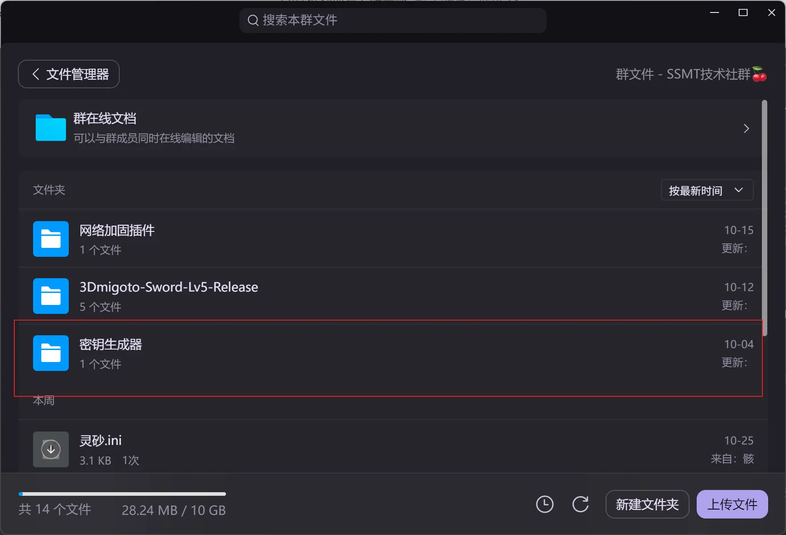
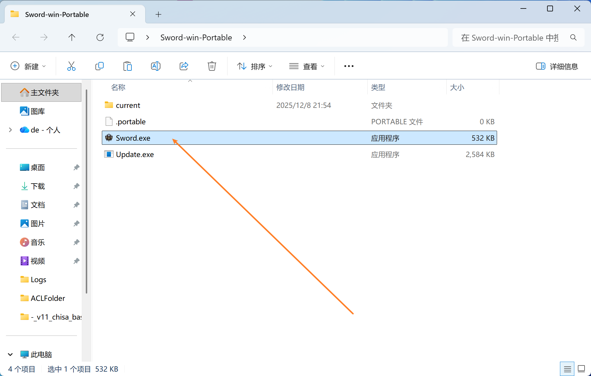
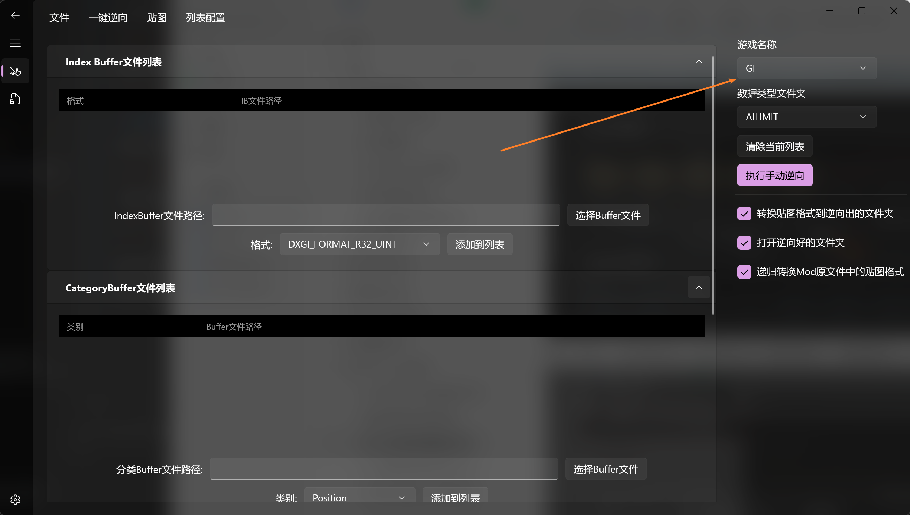
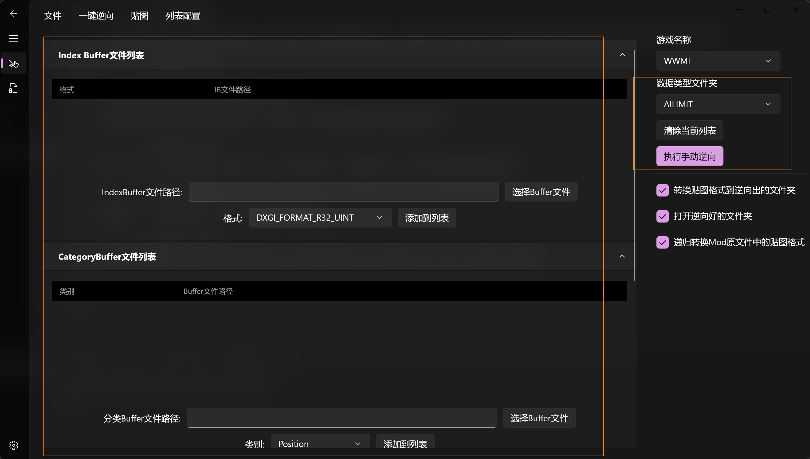

# 🔑 激活 3Dmigoto-Sword-Lv5 插件

赞助后，在爱发电商品附带的自动回复中可以看到 **SSMT 技术社群** 的群号。

进入 SSMT 技术社群，在群文件中获取到密钥生成器：`DBMT-KeyGenerator.exe`

运行后会闪过一个黑框框，并立刻在原地生成一个当前日期的 `.key` 文件，像这样：

随后你把这个 `日期.key` 文件发给我，等我有空激活好之后，我就可以把激活后的 `3Dmigoto-Sword-Lv5.exe` 发给你了。

# 📦 安装步骤

激活好之后，我会发给你一个名为 `3Dmigoto-Sword-Lv5.exe` 的文件。

请先安装一下 **3Dmigoto-Sword-Lv6**，开源地址为：
[https://github.com/StarBobis/3Dmigoto-Sword-Lv6](https://github.com/StarBobis/3Dmigoto-Sword-Lv6)

首先点击Releases：

然后下载最新版本里面的zip压缩包`Sword-win-Portable.zip`：

下载后，解压后直接运行Sword.exe即可：

安装完毕后进行后续步骤。

1. 我们打开 `3Dmigoto-Sword-Lv6`，点击【文件】=>【打开 Assets 文件夹】。

   

2. 随后把 `3Dmigoto-Sword-Lv5.exe` 放进去：

3. 然后就能正常使用上面的一键逆向功能了：

# 🔄 如何更新版本？

Mod 逆向插件持续更新中，新版本可以在群文件中下载获取：

下载其中日期最新的，覆盖 `Assets` 目录下旧的插件即可：

# 🛠️ Mod 逆向页面基础介绍

**文件菜单** 中可以打开各种文件夹，方便查看配置：

**一键逆向菜单** 中包含了我们的主要的功能，分析 Mod 的 ini 并将模型提取出来。点击其中一种分析方式后，弹出的文件选择框中选择 Mod 的 `ini` 文件即可开始自动分析：

> 💡 **提示**：逆向成功后会自动打开逆向出来的模型所在的文件夹。

右侧可以选择当前逆向的 Mod 的游戏类型，在逆向 Mod 之前必须准确选择对应游戏类型名称：

*   **原神、崩坏三、崩坏星穹铁道、绝区零**：有三个一键逆向选项，一般都选第三个，但每个选项都有其独特作用。

    

*   **鸣潮**：只有一个一键逆向选项，但适用于所有类型的鸣潮 Mod。

    

如果你会用数据类型，也可以使用 **手动逆向** 功能，选择数据类型文件夹，拖拽各种 Buffer 文件，然后执行手动逆向。

# 📥 一键逆向后如何导入 Blender

一键逆向后会自动弹出来逆向好的 Mod 文件夹：

里面包含了逆向好的模型以及转换过的贴图。

此时我们打开 Blender，点开 **TheHerta** 插件的面板，点击【一键导入逆向出来的全部模型】：

稍等过后，全部模型都被导入成功了：

# 🎨 逆向出来的 Mod 模型如何上贴图

手动在 Shading 中上贴图已经过时了。我们 Mod 逆向成功，导入模型到 Blender 之后，可以通过插件的功能非常方便的快速上贴图。

首先我们切换到 **材质模式**。

选中要上贴图的模型，在下方点击 【Apply Image to Selected Objects】 即可将贴图列表中的贴图，快速贴上显示：

嗯，可以看到这里上贴图之后，整个都是错误的，且有很多小纹路，这是因为 **数据类型不正确** 导致的。

> ⚠️ **注意**：在下一节内容中我们将讨论数据类型问题，在本节中我们主要演示自动上贴图的步骤。

这里需要注意的是，这里的贴图是 Mod 逆向后打开的文件夹中被转换好的贴图。

上贴图我们一般只上一个 **Diffuse** 贴图就够用了，如果你需要用到其他的贴图，那么最好还是手动上比较好。

这个自动上贴图功能的目的就是为了快速上 DiffuseMap 贴图，方便显示，因为在 Mod 制作流程中一般只需要上这个 DiffuseMap 贴图。

> 💡 **小技巧**：你可以同时选中多个模型来给他们快速上相同的贴图，操作步骤也是一样的。

# 🔍 排除并筛选正确的数据类型

在上一节中，我们快速上贴图之后发现贴图不对：

这是由于 **数据类型不正确** 导致的。我们的 Mod 逆向会全自动分析 Buffer 文件所有可能的数据类型，并且全部逆向出来，以此确保没有遗漏。

现在我们回头再看看之前逆向出来的文件夹：

可以看到里面有多个子文件夹，每个子文件夹的名称，都是以 **8 位数的 Hash 值**，加上下划线，加上 **数据类型名称** 构成的。

这里的每个 Hash 值，在 3Dmigoto 的 Mod 中代表一个基础 Mod 修改单位，可以简单的理解为一个 **模型集合**。

此时每个模型集合被 Mod 逆向自动分析出了多个数据类型，所以你可以看到这里的文件夹有三个相同 Hash值为前缀的但是后面数据类型名称不同的文件夹。

这里虽然有多个数据类型，但是其中 **只有一个数据类型是正确的**，所以我们需要排除错误的数据类型，只保留正确的。

首先我们回到 Blender，观看导入 Blender 后的集合结构：

可以看到每个白色的集合都是一个逆向出来的子文件夹名称，此时我们只需要删除掉错误的数据类型名称的集合，就能排除掉错误的数据类型的模型了。

**那么如何分辨数据类型是否错误呢？** 还记得我们刚才快速上贴图的结果吗？

此时可以打开 UV 查看是否正确：

可以看到 UV 整个都炸了，说明这个数据类型是错误的，所以我们要删除这个错误的数据类型集合：

这样对于 `9e396d3e` 来说就还有两个数据类型了，我们继续检查 UV：

发现上面那个的第二个 UV 是错误的，下面数据类型则全部UV都是正确的：

所以排除上面的数据类型，最后只剩下一个正确的数据类型：

此时自动上贴图的结果就正确了。

下面的 `a702451c` 也是同理，删掉 UV 中错误的数据类型。

最后得到的结果就可以直接使用了。

