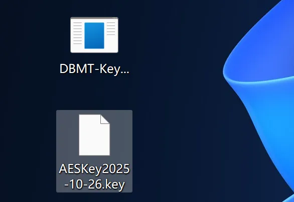
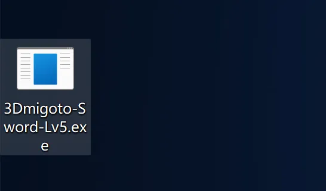
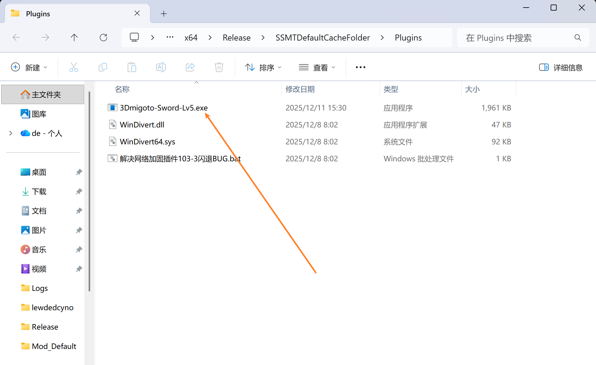

# 🔑 激活 3Dmigoto-Sword-Lv5 插件

赞助后，在爱发电商品附带的自动回复中可以看到 **SSMT 技术社群** 的群号。

进入 SSMT 技术社群，在群文件中获取到密钥生成器：`DBMT-KeyGenerator.exe`

运行后会闪过一个黑框框，并立刻在原地生成一个当前日期的 `.key` 文件，像这样：

随后你把这个 `日期.key` 文件发给我，等我有空激活好之后，我就可以把激活后的 `3Dmigoto-Sword-Lv5.exe` 发给你了。

# 📦 安装步骤

激活好之后，我会发给你一个名为 `3Dmigoto-Sword-Lv5.exe` 的文件。

如果此时还没有安装`SSMT`，请先安装`SSMT`后再进行后续步骤，因为`3Dmigoto-Sword-Lv5`是作为`SSMT`的插件使用的。

1. 我们打开 `SSMT`的`自动逆向`页面，点击【文件】=>【打开Plugins文件夹】。

2. 随后把 `3Dmigoto-Sword-Lv5.exe` 放进去：

3. 然后就能正常使用上面的一键逆向功能了：

# 🔄 如何更新版本？

Mod 逆向插件持续更新中，新版本可以在群文件中下载获取：

下载其中日期最新的，覆盖 `Plugins` 目录下旧的插件即可：

