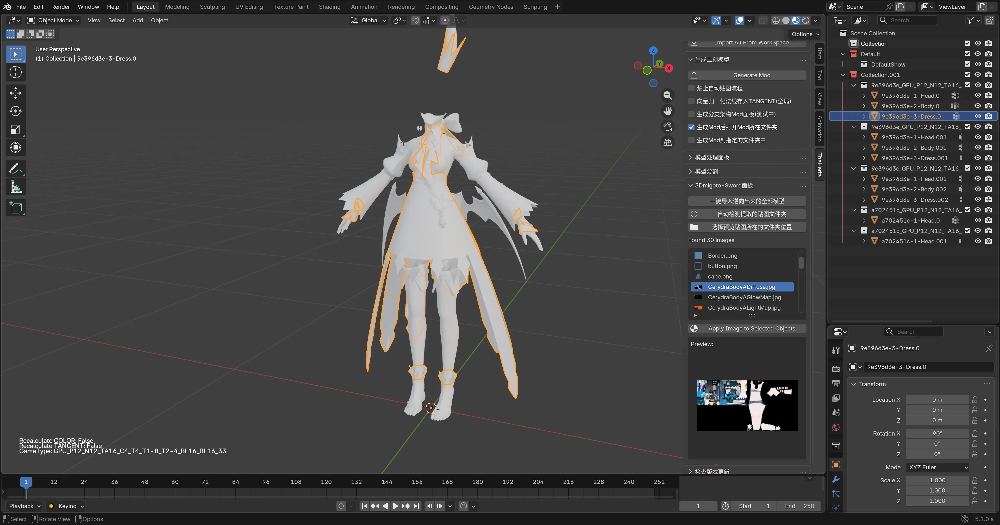

# 📥 一键逆向后如何导入 Blender

一键逆向后会自动弹出来逆向好的 Mod 文件夹：

里面包含了逆向好的模型以及转换过的贴图。

此时我们打开 Blender，点开 **TheHerta** 插件的面板，点击【一键导入逆向出来的全部模型】：

稍等过后，全部模型都被导入成功了：

# 🎨 逆向出来的 Mod 模型如何上贴图

手动在 Shading 中上贴图已经过时了。我们 Mod 逆向成功，导入模型到 Blender 之后，可以通过插件的功能非常方便的快速上贴图。

首先我们切换到 **材质模式**。

选中要上贴图的模型，在下方点击 【Apply Image to Selected Objects】 即可将贴图列表中的贴图，快速贴上显示：

嗯，可以看到这里上贴图之后，整个都是错误的，且有很多小纹路，这是因为 **数据类型不正确** 导致的。

> ⚠️ **注意**：在下一节内容中我们将讨论数据类型问题，在本节中我们主要演示自动上贴图的步骤。

这里需要注意的是，这里的贴图是 Mod 逆向后打开的文件夹中被转换好的贴图。

上贴图我们一般只上一个 **Diffuse** 贴图就够用了，如果你需要用到其他的贴图，那么最好还是手动上比较好。

这个自动上贴图功能的目的就是为了快速上 DiffuseMap 贴图，方便显示，因为在 Mod 制作流程中一般只需要上这个 DiffuseMap 贴图。

> 💡 **小技巧**：你可以同时选中多个模型来给他们快速上相同的贴图，操作步骤也是一样的。
