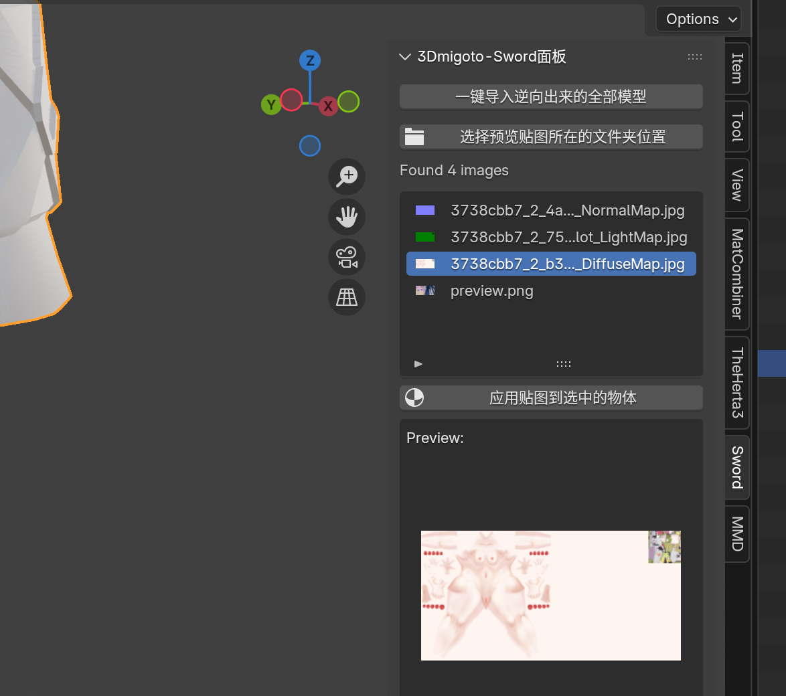

> 补充:TheHerta3版本更新后，逆向后导入和自动上贴图面板已移动至侧边栏`Sword`中，此文档发布时使用的是旧版本，流程上是一样的但是细节不一样，注意区分

# 🔍 排除并筛选正确的数据类型

在上一节中，我们快速上贴图之后发现贴图不对：

这是由于 **数据类型不正确** 导致的。我们的 Mod 逆向会全自动分析 Buffer 文件所有可能的数据类型，并且全部逆向出来，以此确保没有遗漏。

现在我们回头再看看之前逆向出来的文件夹：

可以看到里面有多个子文件夹，每个子文件夹的名称，都是以 **8 位数的 Hash 值**，加上下划线，加上 **数据类型名称** 构成的。

这里的每个 Hash 值，在 3Dmigoto 的 Mod 中代表一个基础 Mod 修改单位，可以简单的理解为一个 **模型集合**。

此时每个模型集合被 Mod 逆向自动分析出了多个数据类型，所以你可以看到这里的文件夹有三个相同 Hash值为前缀的但是后面数据类型名称不同的文件夹。

这里虽然有多个数据类型，但是其中 **只有一个数据类型是正确的**，所以我们需要排除错误的数据类型，只保留正确的。

首先我们回到 Blender，观看导入 Blender 后的集合结构：

可以看到每个白色的集合都是一个逆向出来的子文件夹名称，此时我们只需要删除掉错误的数据类型名称的集合，就能排除掉错误的数据类型的模型了。

**那么如何分辨数据类型是否错误呢？** 还记得我们刚才快速上贴图的结果吗？

此时可以打开 UV 查看是否正确：

可以看到 UV 整个都炸了，说明这个数据类型是错误的，所以我们要删除这个错误的数据类型集合：

这样对于 `9e396d3e` 来说就还有两个数据类型了，我们继续检查 UV：

发现上面那个的第二个 UV 是错误的，下面数据类型则全部UV都是正确的：

所以排除上面的数据类型，最后只剩下一个正确的数据类型：

此时自动上贴图的结果就正确了。

下面的 `a702451c` 也是同理，删掉 UV 中错误的数据类型。

最后得到的结果就可以直接使用了。

