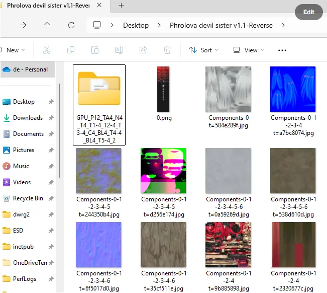
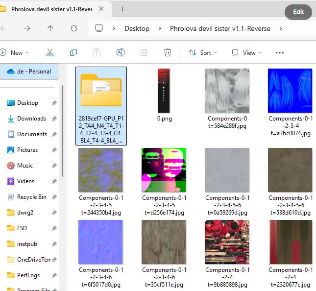

# 📋 SSMT-Reverse Changelog
## 🔄 V1.0.8.5

- 修复了一个鸣潮Mod中注释存在中文无法正常逆向的BUG。
- 现在鸣潮Mod逆向出来后，fmt文件中不再包含额外的翻转信息等等，所有内容都在逆向时处理好了，此外现在不管是SSMT还是WWMI风格，逆向出来都和游戏的解包骨骼完全匹配了。（注意，需要TheHertaV3.2.9或以上版本适配）
- 添加了一个原神的数据类型。

## 🔄 V1.0.8.4
- 鸣潮Mod逆向时，新增解析DrawIndexed上方的注释;Draw Component内容并加入文件名中，此机制对于所有DrawIndexed上一行为注释的都有效，并且会自动判断文件名是否合规，总之更方便(来自 孤军 的反馈建议)

## 🔄 V1.0.8.2

- **重要逆向逻辑修复**：修复了 一键逆向 页面中 `一键逆向基于Buffer的分支Mod的ini` 在存在 <kbd>按键</kbd> 切换时，部分 ini 写法情况下无法正确分辨出不同的按键切换内容的 BUG。

## 🔄 V1.0.8.1

- 修复了一键逆向页面的`一键逆向基于Buffer的分支Mod的ini`逆向出来的文件夹结构无法使用`TheHerta3`的`Sword侧边栏`进行**一键导入**的BUG。

## 🔄 V1.0.8.0

- 新增`apply_rotation_transformation`，只有鸣潮的Mod在使用`WWMI`风格逆向时，会把这个设为`True`，同时配合`TheHertaV3.2.0`版本即可正常导入适用于`WWMI-Tools`流程的逆向出来的模型。

## 🔄 V1.0.7.9

- 移除了无效的fmt文件属性flip_mirror和flip_winding
- 现在如果选择了WWMI风格，则会自动设置Z轴旋转180度以适配WWMI的模型朝向，避免镜像权重BUG（需配合TheHertaV3.1.9版本使用）

## 🔄 V1.0.7.8

- 现在鸣潮 Mod 逆向有 WWMI 和 SSMT 两种命名风格可选了，需要更新 3Dmigoto-Sword-Lv6 V1.1.2 才能使用此功能。

## 🔄 V1.0.7.7

- 🐛 修复了当 WWMI 逆向的 Mod 不存在 ShapeKey 时，无法正常导入 Blender 的 BUG。

## 🔄 V1.1.0

3Dmigoto-Sword-Lv6 已开源到 Github，不过我们的逆向插件 3Dmigoto-Sword-Lv5 仍然是闭源的。

所以后续更新日志这里只会描述 3Dmigoto-Sword-Lv5 的更新日志，关于 3Dmigoto-Sword-Lv6 的更新日志可以去 Github 的 Release 中自行查看：

> **GitHub Releases**: [3Dmigoto-Sword-Lv6](https://github.com/StarBobis/3Dmigoto-Sword-Lv6)
>
> 

> <b>🔗 访问： </b> 
> <a href="https://github.com/StarBobis/3Dmigoto-Sword-Lv6" style="color:#1976D2; font-weight:bold;">3Dmigoto-Sword-Lv6 — GitHub Releases</a>
> 

## 🔄 V1.0.9

- 把 Mod 锁机器码和 Mod 加密也集成进来了，安装对应插件到 Assets 目录即可使用。
- 把打开 Plugins 文件夹改名为打开 Assets 文件夹了，因为路径变更了，但是用法还是一样的，把插件拖拽进去就行了，注意名字别搞错了。

## 🔄 V1.0.8 重大变更

- Mod 逆向已从 SSMT 中移除，转为单独的 3Dmigoto-Sword-Lv6 工具，只在群文件发布。

3Dmigoto-Sword-Lv6 需要配合 TheHerta3 V3.0.3

> **TheHerta3 Release**: [V3.0.3](https://github.com/StarBobis/TheHerta3/releases/tag/V3.0.3)

或以上版本才能实现一键导入逆向出来的模型，否则就只能手动导入了。

## 🔄 V1.0.7.6

- 【一键逆向 Mod 的 ini】(英文 Reverse Single Mod's Ini) 以及【一键逆向 基于 Buffer 的分支 Mod 的 ini】(英文 Reverse Buffer Based Toggle Mod's Ini) 逆向出的格式得到了改变，现在变得和【一键逆向 基于 DrawIndexed 的分支 Mod 的 ini】(英文 Reverse DrawIndexed Based Toggle Mod's Ini) 结果相同了，方便使用 Blender 插件进行 一键导入 和快速排除错误数据类型的操作。

- 此版本开始，三个 Mod 逆向选项逆向出来的文件不再全部放在 -Reverse 文件夹里面了，而是根据选择的逆向方法不同，分别生成在不同的文件夹里。包括 WWMI 逆向也会放在单独的标识文件夹中。【注意！要使用此特性必须将 SSMT 更新到 V2.4.5 或最新版本，否则会导致逆向出的 Mod 和逆向出的 Mod 的贴图不在一个文件夹中，导致无法在 Blender 中用插件自动上贴图】
- 此版本开始，可以自由选择是否将 Mod 文件中的 dds 贴图转换为目标格式了，因为我们逆向出来的 Reversed 文件夹里一般已经有转换好的贴图了，所以此时在 Mod 文件夹中的转换似乎无关紧要，关闭后能够减少 Mod 逆向所需的总时间，但是部分特殊情况无法识别时，还是开启这个选项在 Mod 的原文件夹中更方便一些，所以此选项是默认开启的，不论怎样，我们还有菜单项中的贴图转换可以使用，所以不必担心【注意！要使用此特性需要将 SSMT 更新到 V2.4.5 或最新版本】

## 🔄 V1.0.7.5

- 🐛 修复了当多个 TextureOverride 的 Hash 值相同，且 match_first_index 相同时，会被识别为同一个部位，导致逆向出的模型缺失的 BUG。

## 🔄 V1.0.7.4

- 🔧 重构升级了 WWMI 的 Mod 逆向逻辑。
- 🐛 重要 BUG 修复：WWMI 的 Mod 逆向现在对新角色（使用 RemapBlend 技术的，使用 Merged 架构的，顶点组数量超过 256 个的模型的 Mod，现在可以正确的逆向出原本的 Merged 顶点组架构了），没修复此 Mod 之前，逆向这些新角色之后得到的权重索引位置和游戏中直接提取出来的位置是不一致的，修复后解决了此问题，索引位置完全一致，可以一键导入，修改后直接导出了，省去了修改顶点组索引的时间。

> **注意**: 此版本逆向插件需要配合 TheHerta V2.2.6 或以上版本才能按照预期工作。

## 🔄 V1.0.7.3

- ➕ 添加了 DRAW_TYPE 的条件解析支持。
- ➕ 添加了 elif 语法的解析支持。

## 🔄 V1.0.7.2

- 🐛 修复了运行日志会生成在当前目录而不是上一级的 Logs 目录下，从而导致工具中无法查看 Mod 逆向运行日志的问题。

## 🔄 V1.0.7.1

- ➕ 添加了部分第五人格 Neox3 引擎的 Mod 逆向支持，游戏名称对应选 IdentityV2。

## 🔄 V1.0.7.0

- ➕ 添加了第五人格 IdentityV 的 Mod 的一键逆向支持。

## 🔄 V1.0.6.9

- 🐛 修复了 condition 解析失败会导致 Mod 逆向直接终止的 BUG。

## 🔄 V1.0.6.8

- 现在逆向出来的 FMT 文件中，部分数据类型 Element 也会包含精确指定的 ByteWidth 值了。
- 移除了 WuWa 选项，只保留 WWMI 的逆向选项。
- WWMI 的新角色数据类型（每个顶点最多受 8 个骨骼控制的角色）得到了更新，现在可以正确的逆向出之前逆向不出来的数据类型了，例如弗洛洛。

## 🔄 V1.0.6.7

- ➕ 添加了一个原神物体数据类型的逆向支持。

## 🔄 V1.0.6.6

### (1) 鸣潮 Mod 逆向后的名称变更

鸣潮 Mod 逆向后的名称，由单纯的数据类型：

变更为由以该 Mod 的 VertexBuffer 的 Hash 值开头的如下方式命名：

这个变更是考虑到，一个目录下会存在多个 ini，此时每个 ini 虽然都代表一个独立的 mod，hash 值也不同，但是按照旧版本的逆向方法，创建的文件夹就会重叠在一起，导致用户逆向的结果不完整，现在用起来更方便了。

### (2) 鸣潮 Mod 逆向后放入的文件夹会新增逆向时选择的 ini 名称

这是因为，当 Mod 使用了基于 namespace 的 mod 合并技术

(WWMI Multiple ini Merger + ini group Modding Tool for Wuthering Waves | WuWa Modding Tools)

> **工具链接**: [WuWa Modding Tools](https://gamebanana.com/tools/19826)

之后，虽然一个目录下存在多个 ini 文件，但是这

多个 ini 文件代表的 mod 的 hash 值是相同的，此时尽管我们上面已经添加了逆向出来的 Hash 值区分，却仍然会把多个拆分的 Mod 逆向到一个文件夹中，造成了混淆。

以如下 Mod 文件结构示例：

其中 0mod.ini 是这个 Mod 的变量控制文件, 1mod.ini 和 2mod.ini 各自代表了这一个 Mod 的不同拆分样式，此时逆向就会触发上述结果的混淆。

改进后逆向的文件夹如下，可以看到两次逆向的结果生成了两个文件夹：

可以看到逆向之后出现了两个文件夹，名称分别含有对应的 ini 文件的名称，此时虽然两个 Mod 的分支的 Hash 值相同，但逆向后不会出现覆盖在一起混淆的问题了。

## 🔄 V1.0.6.3

- ➕ 新增 WuWa 选项。
- 从此版本开始，将只发送 3Dmigoto-Sword-Lv5.vmp.exe，放到 SSMT-Package 的 Plugins 目录下，即可在 SSMT 中解锁 Mod 逆向页面，不再提供单独的 3Dmigoto-Sword-Lv6 程序。

新的安装方法看这个链接：

> **安装指南**: [安装插件](https://starbobis.github.io/SSMT-Documents/Tutorials/Plugins/SSMT-Reverse/(2)%E5%AE%89%E8%A3%85%E6%8F%92%E4%BB%B6/(2)%E5%AE%89%E8%A3%85%E6%8F%92%E4%BB%B6.html)

## 🔄 V1.0.6.2-3

- 🐛 修复了无法作为 SSMT 插件使用的 BUG，现在可以把 3Dmigoto-Sword-Lv5.vmp.exe 放到 SSMT 的 SSMT-Package 的 Plugins 目录里，在 SSMT 最新版中解锁 Mod 逆向页面了，其用法和 Sword-Lv6 相同。

## 🔄 V1.0.6.2-2

- ➕ 添加了 ZZZ 的 Trigger 的武器的 XXMI CategoryExpansion 混淆数据类型，现在可以正常逆向出来正确 UV 的模型了。

## 🔄 V1.0.6.2

- 🔧 重要更新：现在【一键逆向 Mod 的 ini】和【一键逆向 DrawIndexed 分支 Mod 的 ini】以及【一键逆向 Toggle <kbd>按键</kbd> 切换 Mod 的 ini】均支持全自动解析和破解使用了反 Mod 逆向之 IB 膨胀混淆技术的 Mod。

# V1.0.6.1

- 🔧 重要更新：手动逆向增强，现在可以自动识别出反 Mod 逆向之 IB 膨胀技术，并且自动把使用了 IB 膨胀技术的 IndexBuffer 文件进行反膨胀处理，确保逆向结果准确。（解决了使用 IB 膨胀技术的 Mod，手动逆向后无法导入到 Blender 的问题。）（牢记我们工具中最强的技术是手动逆向，如果遇到一键逆向无法处理 IB 膨胀技术的 Mod，则可以使用手动逆向来进行处理，案例 Mod ZZZ：FemmySeth）

## 🔄 V1.0.6.0

- 🐛 修复了逆向出的适用于 WWMI 的数据类型的 COLOR 的数据类型错误的问题，现已设置为 WWMI-Tools 所需的 R16G16_UNORM。
- ➕ 新增一个 WWMI 的数据类型，现在能逆向所有已知类型的 WWMI Mod 了。

## 🔄 V1.0.5.9

- 因为 Sword-Lv6 依然部分依赖于 Sword-Lv5 插件，所以无法在中文路径下正常工作，所以添加了程序启动时自动检测是否位于中文路径，如果是则弹出对话框进行提示。
- 现在逆向出来生成的 FMT 文件中不再含有过时的 FlipNormal 设计，移除了 flip_normal 字段。（需要配合 SSMT Blender Plugin V1.5.9 或以上版本使用）
- 现在逆向出来生成的 FMT 文件中新增 FlipFaceOrientation 设计，用于控制导入 Blender 时是否翻转面朝向，其它游戏默认为 False，只有 WWMI 为 True，解决了 WWMI 逆向出来的 Mod 导入到 Blender 后面朝向不正确的问题。（需要配合 SSMT Blender Plugin V1.5.9 或以上版本使用）
- 现在逆向全自动解析新增了对 CustomShaderTransparency 中的 DrawIndexed 解析，以后遇到这种不再需要手动复制粘贴过去了。
- 逆向普通单个 Mod 的 ini 中的 Blend 校验进行了升级，输出的文件名后追加 _ 和 Resource 资源排列索引，在 Texcoord 和 Blend 槽位的长度相同时会自动进行校验，即使校验失败也能够正确的逆向出两个不同的数据类型，方便导入 Blender 时进行选择（而不是像旧版本一样只有一个数据类型且可能是错误的导致导入 Blender 后卡死，现在即使校验失败也有多个数据类型，确保总有一个是能用的，如果校验成功则只有一个，大大提高了这种特殊情况下的 Mod 逆向成功率）
- 现在 一键逆向 后的贴图转换，不会再搜索 png 格式贴图加入待转换目录了，一定程度上可以避免多次重复执行逆向时，已经转换出来的 ConvertedTextures 被再次转换，如此嵌套递归导致 Mod 文件夹充满被转换的冗余贴图导致空间占用越来越大的且重复执行逆向时占用时间越来越长的问题。
- 现在一键逆向后，会把 dds 贴图转换为对应格式放到逆向出的 Reverse 文件夹下了，但是要注意，如果文件夹结构出现多层嵌套的贴图如果出现名称重复则会进行覆盖，不过你仍然可以在原始 Mod 文件夹中找到完整的被转换后的贴图。（逆向执行时间由于额外的贴图转换步骤，会略微延长）

## 🔄 V1.0.5.8

- ➕ 现在一键逆向出的 fmt 文件新增 scale 属性，便于控制导入到 Blender 时的模型比例，需要 Herta V1.3.1 或以上版本才能生效。（解决鸣潮 Mod 逆向后模型导入后体积过大，还需要手动调小问题）
- ➕ 现在一键逆向出的 fmt 文件新增 flip_normal 属性，便于控制导入到 Blender 时的模型法线问题。（解决鸣潮 Mod 逆向后模型导入后法线是相反的问题，因为手动翻转是无法得到正常法线的，需要 SSMT 插件 V1.3.8 或以上版本生效）
- ➕ 现在一键逆向出的 fmt 文件新增 flip_winding 属性，便于控制导入到 Blender 时的模型朝向问题。（解决鸣潮 Mod 逆向后模型导入后朝向和米游系列相反的问题，需要 SSMT 插件 V1.3.8 或以上版本生效）
- ➕ 现在一键逆向出的 fmt 文件新增 flip_mirror 属性，便于控制导入到 Blender 时的模型镜像问题。（解决鸣潮 Mod 逆向后模型导入后模型是镜像的问题，因为部分用户需要用来做其它事情，需要 SSMT 插件 V1.3.8 或以上版本生效）

## 🔄 V1.0.5.7

- ➕ 现在一键逆向出的 fmt 文件新增 scale 属性，便于控制导入到 Blender 时的模型比例，需要 Herta V1.3.1 或以上版本才能生效。（解决模型导入后体积过大，还需要手动调小问题）
- ➕ 现在一键逆向出的 fmt 文件新增 rotation_euler_x, rotation_euler_y, rotation_euler_z 属性，便于控制导入到 Blender 时的模型旋转角度，需要 Herta V1.3.2 或以上版本才能生效。（解决模型导入后默认躺倒，还需要手动旋转扶正问题）

## 🔄 V1.0.5.6-2

- 🐛 修复了鸣潮 Mod 逆向出来后，WWMI-Tools 的数据类型的 COLOR1 格式错误的问题，现在逆向出的 WWMI-Tools 的数据类型可以使用 WWMI-Tools 导出后生成正常的角色轮廓线了。

## 🔄 V1.0.5.6

- 🐛 修复了打开最新的日志文件时，如果不存在日志文件则错误无法被捕获的问题，不会出现闪退让人摸不到头脑的问题了。
- 一键逆向 ini 的三个选项都加了 try-catch 捕获异常，不会出现闪退让人摸不到头脑的问题了。
- 一键逆向 ini 前会检查 3Dmigoto-Sword-Lv5 插件是否存在，如果不存在则会给出提示，因为这个插件使用 vmp 加壳，很可能被杀软提前干掉了。
- 🐛 修复了点击一键逆向 ini，然后点击取消后，此时不存在 log 文件会导致闪退，存在日志文件则会打开上一次运行的日志文件的 BUG，此 BUG 曾造成理解混淆。

## 🔄 V1.0.5.5

现在逆向成功后，如果你没有开启这个设置项：

则会弹出一个提示，此功能诞生的原因是大批量 Mod 逆向时，会弹出超多文件夹导致桌面混乱，而如果什么都不提示，又很容易让人心里没底，因为看不到什么时候成功，逆向需要 3 到 5 秒，可能会因为没有成功提示多等很长时间。

总之此版本解决了这个问题。另外手动逆向现在也同样适用于这个机制了。

## 🔄 V1.0.5.4

### 1. 鸣潮一键逆向出来的模型文件名称变更

现在鸣潮 Mod 逆向出来，会自动把各个拆分的小部位的名称后面加上 _IndexCount_IndexOffset

第一个数字是绘制索引数，第二个数字是索引偏移值，如下图

正好可以跟 ini 中 drawindexed = 的用法的顺序对的上，这样就能直观的感受到每个部位的模型是哪一个 drawindexed = 逆向出来的。

而同时，一般良好习惯的 Mod 作者都会有规律的重命名各个模型的名称，这就会导致 Mod 的 ini 文件里，都会给 drawindexed = 添加上对应的注释，如下图：

这样我们就可以对照 ini，快速的根据注释知道我们逆向出来的每个部位是什么内容，在进行 Mod 修复时，能够更加灵活方便。

### 2. 鸣潮一键逆向按钮名称变更

我们之前的按钮是这样的：

由于其它游戏都有三个逆向按钮，鸣潮只有一个会给人一种混淆的感觉，错认为这个只能逆向普通单个 Mod 的 ini 而不能逆向多个 drawindexed 类型的。

所以对名称进行了修改，改为如下不含有歧义的名称：

英文对应：

## 🔄 V1.0.5.3

- 现在手动逆向之前会提示你上次手动逆向的结果是否需要删除后再进行逆向，点是则清除 Reversed 文件夹下所有内容并继续逆向，点否则直接进行逆向不删除历史文件。

- ➕ 新增设置项【一键逆向 Mod 的 ini 文件后，是否自动打开逆向好的目标文件夹】，勾选后一键逆向 Mod 的 ini 后会自动打开 Mod 的文件夹，不勾选则只弹出逆向成功的提示：

- 现在一键逆向 Mod 的 ini 失败后，会自动打开最新的日志文件方便排查错误了。

## 🔄 V1.0.5.2

- 🐛 修复了 BLENDINDICES 校验对物体 Mod 总是报错的 BUG。

## 🔄 V1.0.5.1

- 🐛 修复了选择游戏那里可以自己填写的问题，因为并不需要自己填写，所以会导致点上去卡一下，现在改成不能填写了，点上去不会有一瞬间的卡顿感了，优化使用体验。
- 🔧 优化了手动 Mod 逆向页面的拖拽流程，现在直接拖拽到列表里就能根据当前选择的 Format 或 Category 来新往下增一行啦，用起来更加丝滑流畅。如图所示，黑色部分也可以直接拖拽文件上去：

## 🔄 V1.0.5.0

- ➕ 设置页面新增是否在逆向 Mod 的 ini 完成后自动转换贴图格式的勾选项配置，勾选后即可节省手动转换贴图的步骤，但是会延长执行速度。
- ➕ 设置页面新增逆向完 ini 后自动转换贴图的格式。

## 🔄 V1.0.4.9

- 🔄 更新了背景图。
- 🔧 优化了 WWMI 一键逆向 Mod 时的数据类型识别算法。
- 🐛 修复了 WWMI 一键逆向只能识别出一种数据类型的 BUG，现在会把识别到的所有可能的数据类型都逆向出来，优先 GPU 数据类型（也就是说现在支持逆向出 WWMI-Tools 使用的把 Texcoord1 当 Color1 的那个数据类型了，导入 Blender 即可直接用于 WWMI-Tools 的 Mod 制作）。

## 🔄 V1.0.4.8

- 🔄 更新了全新的 GUI。
- 🐛 修复了切换到 WWMI 后再切换到其它游戏时，无法显示另外两个逆向按钮的 BUG。
- 🔄 Mod 手动逆向从 DBMT 中迁移过来了。

## 🔄 V1.0.4.7

- 🔧 算法优化：添加了部分数据类型的 BLENDINDICES 校验，减少导入 Blender 中卡死的几率。(修复了 ZZZ 的大猫猫的 Mod 使用一键逆向 DrawIndexed 逆向出来，同个数据类型存在两个文件夹，此时其中一个错误的中的模型导入 Blender 会导致 Blender 卡死的问题)。

## 🔄 V1.0.4.6

- 🔄 切换到 WWMI 游戏时，现在只会显示一键逆向普通单个 Mod 的 ini 了，因为对于 WWMI 来说另外两个按钮是无效的。
- ➕ 添加了贴图批量转换功能，目前可以转换为常用的 .jpg .png 或 .tga 格式。

## 🔄 V1.0.4.5

- ➕ 添加了对 DrawIndexed = Skip 的解析。

## 🔄 V1.0.4.4

- ➕ 更新了崩铁 3.2 版本之后格式 Mod 的逆向支持。

## 🔄 V1.0.4.3

- ➕ 添加了图标
- 🐛 修复了点击逆向选择 ini 文件后如果啥都不选会错误弹出无意义提示的 BUG。

## 🔄 V1.0.4.2-2

- 🔄 更新了文档链接的地址，现在 3Dmigoto-Sword-Lv5 有了独立的文档链接了。

## 🔄 V1.0.4.2

- 🔄 3Dmigoto-Sword-Lv5 有了单独的 GUI 界面，现已作为独立工具发布。

## 🔄 V1.0.4.1-2

- 🐛 修复了在 DBMT V1.1.6.5 版本开始无法使用逆向插件的 BUG。
- 移除了从 Dump 文件中逆向提取的功能，因为太少用了，而且最近的 Mod 越来越复杂，几乎无法从游戏里 dump 到正确的 Buffer 内容，所以后面还得靠一键逆向 ini。

## 🔄 V1.0.4.1

- 🐛 此版本修复了由于旧的 PatchBLENDWEIGHTS 处理不当导致的 BUG，该 BUG 会导致 Blend 槽位中仅存在 BLENDINDICES 时逆向出来的 fmt 文件描述错误，现已移除弃用的 PatchBLENDWEIGHTS 机制，请更新到最新版 Catter 以支持此特性。（说人话：修复了绝区零扳机武器 Mod 无法逆向的 BUG，但是需要更新 Catter 到最新版才能支持导入到 Blender。）

## 🔄 V1.0.4.0

- 🔄 此版本主要更新了一个鸣潮的数据类型，用于兼容 WWMI-Tools 中含有 COLOR1 的数据类型（在 DBMT 正确的数据类型中，WWMI-Tools 对应的 COLOR1 是 DBMT 的 TEXCOORD1）以解决逆向出的模型在使用 WWMI-Tools 导出时缺失 COLOR1，以及生成 Mod 后轮廓线丢失的问题。

---

## 免责声明

> 

> <b>⚠️ 免责声明：</b> 本文档仅供学习、研究与交流使用；禁止直接用于商业用途。文中信息仅供参考，作者与发布者不对因使用本文档内容而产生的任何问题承担责任。本文档内容部分由 AI 协助生成，仅供参考。
> 

---

_最后更新：2025 年 12 月 16 日_

> 感谢阅读！希望这份日志既让你安心，也让你微笑（大约 1%）。
