# V1.1.0

3Dmigto-Sword-Lv6已开源到Github，不过我们的逆向插件3Dmigoto-Sword-Lv5仍然是闭源的

所以后续更新日志这里只会描述3Dmigoto-Sword-Lv5的更新日志，关于3Dmigoto-Sword-Lv6的更新日志可以去Github的Release中自行查看：

https://github.com/StarBobis/3Dmigoto-Sword-Lv6

# V1.0.9
- 把Mod锁机器码和Mod加密也集成进来了，安装对应插件到Assets目录即可使用。
- 把打开Plugins文件夹改名为打开Assets文件夹了，因为路径变更了，但是用法还是一样的，把插件拖拽进去就行了，注意名字别搞错了。

# V1.0.8重大变更

- Mod逆向已从SSMT中移除，转为单独的3Dmigoto-Sword-Lv6工具，只在群文件发布。

3Dmigoto-Sword-Lv6需要配合TheHerta3 V3.0.3

https://github.com/StarBobis/TheHerta3/releases/tag/V3.0.3 

或以上版本才能实现一键导入逆向出来的模型，否则就只能手动导入了。

# V1.0.7.6
- 【一键逆向Mod的ini】(英文Reverse Single Mod's Ini) 以及【一键逆向基于Buffer的分支Mod的ini】(英文Reverse Buffer Based Toggle Mod's Ini)逆向出的格式得到了改变，现在变得和【一键逆向基于DrawIndexed的分支Mod的ini】(英文Reverse DrawIndexed Based Toggle Mod's Ini)结果相同了，方便使用Blender插件进行一键导入和快速排除错误数据类型的操作。

- 此版本开始，三个Mod逆向选项逆向出来的文件不再全部放在-Reverse文件夹里面了，而是根据选择的逆向方法不同，分别生成在不同的文件夹里。包括WWMI逆向也会放在单独的标识文件夹中。【注意！要使用此特性必须将SSMT更新到V2.4.5或最新版本，否则会导致逆向出的Mod和逆向出的Mod的贴图不在一个文件夹中，导致无法在Blender中用插件自动上贴图】
- 此版本开始，可以自由选择是否将Mod文件中的dds贴图转换为目标格式了，因为我们逆向出来的Reversed文件夹里一般已经有转换好的贴图了，所以此时在Mod文件夹中的转换似乎无关紧要，关闭后能够减少Mod逆向所需的总时间，但是部分特殊情况无法识别时，还是开启这个选项在Mod的原文件夹中更方便一些，所以此选项是默认开启的，不论怎样，我们还有菜单项中的贴图转换可以使用，所以不必担心【注意！要使用此特性需要将SSMT更新到V2.4.5或最新版本】

# V1.0.7.5
- 修复了当多个TextureOverride的Hash值相同，且match_first_index相同时，会被识别为同一个部位，导致逆向出的模型缺失的BUG。
# V1.0.7.4
- 重构升级了WWMI的Mod逆向逻辑。
- 重要BUG修复：WWMI的Mod逆向现在对新角色（使用RemapBlend技术的，使用Merged架构的，顶点组数量超过256个的模型的Mod，现在可以正确的逆向出原本的Merged顶点组架构了），没修复此Mod之前，逆向这些新角色之后得到的权重索引位置和游戏中直接提取出来的位置是不一致的，修复后解决了此问题，索引位置完全一致，可以一键导入，修改后直接导出了，省去了修改顶点组索引的时间。
注意：此版本逆向插件需要配合TheHertaV2.2.6或以上版本才能按照预期工作。
# V1.0.7.3
- 添加了DRAW_TYPE的条件解析支持。
- 添加了elif语法的解析支持。
# V1.0.7.2
- 修复了运行日志会生成在当前目录而不是上一级的Logs目录下，从而导致工具中无法查看Mod逆向运行日志的问题。

# V1.0.7.1
- 添加了部分第五人格 Neox3引擎的Mod逆向支持，游戏名称对应选IdentityV2。

# V1.0.7.0
- 添加了第五人格 IdentityV的Mod的一键逆向支持。

# V1.0.6.9
- 修复了condition解析失败会导致Mod逆向直接终止的BUG。

# V1.0.6.8
- 现在逆向出来的FMT文件中，部分数据类型Element也会包含精确指定的ByteWidth值了。
- 移除了WuWa选项，只保留WWMI的逆向选项。
- WWMI的新角色数据类型（每个顶点最多受8个骨骼控制的角色）得到了更新，现在可以正确的逆向出之前逆向不出来的数据类型了，例如弗洛洛。

# V1.0.6.7
添加了一个原神物体数据类型的逆向支持。

# V1.0.6.6

(1) 鸣潮Mod逆向后的名称变更

鸣潮Mod逆向后的名称，由单纯的数据类型：

变更为由以该Mod的VertexBuffer的Hash值开头的如下方式命名：

这个变更是考虑到，一个目录下会存在多个ini，此时每个ini虽然都代表一个独立的mod，hash值也不同，但是按照旧版本的逆向方法，创建的文件夹就会重叠在一起，导致用户逆向的结果不完整，现在用起来更方便了。

(2) 鸣潮Mod逆向后放入的文件夹会新增逆向时选择的ini名称

这是因为，当Mod使用了基于namespace的mod合并技术

(WWMI Multiple ini Merger + ini group Modding Tool for Wuthering Waves | WuWa Modding Tools)

https://gamebanana.com/tools/19826

之后，虽然一个目录下存在多个ini文件，但是这

多个ini文件代表的mod的hash值是相同的，此时尽管我们上面已经添加了逆向出来的Hash值区分，却仍然会把多个拆分的Mod逆向到一个文件夹中，造成了混淆。

以如下Mod文件结构示例：

其中0mod.ini是这个Mod的变量控制文件,1mod.ini 和 2mod.ini 各自代表了这一个Mod的不同拆分样式，此时逆向就会触发上述结果的混淆。

改进后逆向的文件夹如下，可以看到两次逆向的结果生成了两个文件夹：

可以看到逆向之后出现了两个文件夹，名称分别含有对应的ini文件的名称，此时虽然两个Mod的分支的Hash值相同，但逆向后不会出现覆盖在一起混淆的问题了。

# V1.0.6.3

- 新增WuWa选项。
- 从此版本开始，将只发送3Dmigoto-Sword-Lv5.vmp.exe，放到SSMT-Package的Plugins目录下，即可在SSMT中解锁Mod逆向页面，不再提供单独的3Dmigoto-Sword-Lv6程序。

新的安装方法看这个链接：

https://starbobis.github.io/SSMT-Documents/Tutorials/Plugins/SSMT-Reverse/(2)%E5%AE%89%E8%A3%85%E6%8F%92%E4%BB%B6/(2)%E5%AE%89%E8%A3%85%E6%8F%92%E4%BB%B6.html

# V1.0.6.2-3

- 修复了无法作为SSMT插件使用的BUG，现在可以把3Dmigoto-Sword-Lv5.vmp.exe放到SSMT的SSMT-Package的Plugins目录里，在SSMT最新版中解锁Mod逆向页面了，其用法和Sword-Lv6相同。

# V1.0.6.2-2

- 添加了ZZZ的Trigger的武器的XXMI CategoryExpansion混淆数据类型，现在可以正常逆向出来正确UV的模型了。

# V1.0.6.2
- 重要更新：现在【一键逆向Mod的ini】和【一键逆向DrawIndexed分支Mod的ini】以及【一键逆向Toggle按键切换Mod的ini】均支持全自动解析和破解使用了反Mod逆向之IB膨胀混淆技术的Mod。

# V1.0.6.1

- 重要更新：手动逆向增强，现在可以自动识别出反Mod逆向之IB膨胀技术，并且自动把使用了IB膨胀技术的IndexBuffer文件进行反膨胀处理，确保逆向结果准确。（解决了使用IB膨胀技术的Mod，手动逆向后无法导入到Blender的问题。）（牢记我们工具中最强的技术是手动逆向，如果遇到一键逆向无法处理IB膨胀技术的Mod，则可以使用手动逆向来进行处理，案例Mod ZZZ：FemmySeth）

# V1.0.6.0
- 修复了逆向出的适用于WWMI的数据类型的COLOR的数据类型错误的问题，现已设置为WWMI-Tools所需的R16G16_UNORM。
- 新增一个WWMI的数据类型，现在能逆向所有已知类型的WWMI Mod了。

# V1.0.5.9

- 因为Sword-Lv6依然部分依赖于Sword-Lv5插件，所以无法在中文路径下正常工作，所以添加了程序启动时自动检测是否位于中文路径，如果是则弹出对话框进行提示。
- 现在逆向出来生成的FMT文件中不再含有过时的FlipNormal设计，移除了flip_normal字段。（需要配合SSMT Blender Plugin V1.5.9 或以上版本使用）
- 现在逆向出来生成的FMT文件中新增FlipFaceOrientation设计，用于控制导入Blender时是否翻转面朝向，其它游戏默认为False，只有WWMI为True，解决了WWMI逆向出来的Mod导入到Blender后面朝向不正确的问题。（需要配合SSMT Blender Plugin V1.5.9 或以上版本使用）
- 现在逆向全自动解析新增了对CustomShaderTransparency中的DrawIndexed解析，以后遇到这种不再需要手动复制粘贴过去了。
- 逆向普通单个Mod的ini中的Blend校验进行了升级，输出的文件名后追加_和Resource资源排列索引，在Texcoord和Blend槽位的长度相同时会自动进行校验，即使校验失败也能够正确的逆向出两个不同的数据类型，方便导入Blender时进行选择（而不是像旧版本一样只有一个数据类型且可能是错误的导致导入Blender后卡死，现在即使校验失败也有多个数据类型，确保总有一个是能用的，如果校验成功则只有一个，大大提高了这种特殊情况下的Mod逆向成功率）
- 现在一键逆向后的贴图转换，不会再搜索png格式贴图加入待转换目录了，一定程度上可以避免多次重复执行逆向时，已经转换出来的ConvertedTextures被再次转换，如此嵌套递归导致Mod文件夹充满被转换的冗余贴图导致空间占用越来越大的且重复执行逆向时占用时间越来越长的问题。
- 现在一键逆向后，会把dds贴图转换为对应格式放到逆向出的Reverse文件夹下了，但是要注意，如果文件夹结构出现多层嵌套的贴图如果出现名称重复则会进行覆盖，不过你仍然可以在原始Mod文件夹中找到完整的被转换后的贴图。（逆向执行时间由于额外的贴图转换步骤，会略微延长）

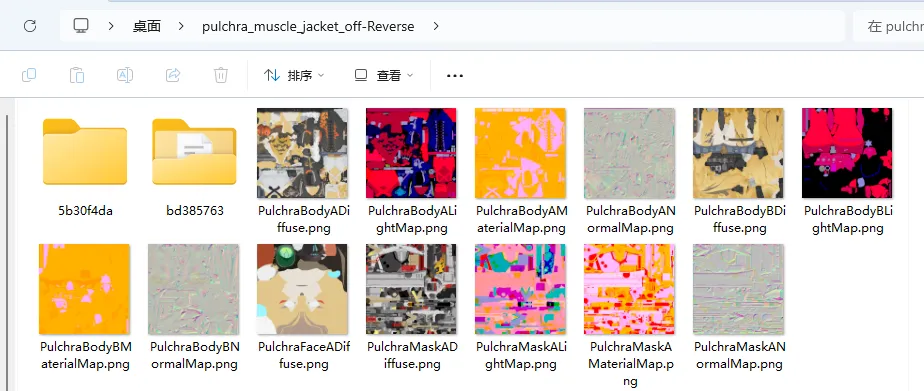

# V1.0.5.8

- 现在一键逆向出的fmt文件新增scale属性，便于控制导入到Blender时的模型比例，需要HertaV1.3.1或以上版本才能生效。（解决鸣潮Mod逆向后模型导入后体积过大，还需要手动调小问题）
- 现在一键逆向出的fmt文件新增flip_normal属性，便于控制导入到Blender时的模型法线问题。（解决鸣潮Mod逆向后模型导入后法线是相反的问题，因为手动翻转是无法得到正常法线的，需要SSMT插件V1.3.8或以上版本生效）
- 现在一键逆向出的fmt文件新增flip_winding属性，便于控制导入到Blender时的模型朝向问题。（解决鸣潮Mod逆向后模型导入后朝向和米游系列相反的问题，需要SSMT插件V1.3.8或以上版本生效）
- 现在一键逆向出的fmt文件新增flip_mirror属性，便于控制导入到Blender时的模型镜像问题。（解决鸣潮Mod逆向后模型导入后模型是镜像的问题，因为部分用户需要用来做其它事情，需要SSMT插件V1.3.8或以上版本生效）

# V1.0.5.7

- 现在一键逆向出的fmt文件新增scale属性，便于控制导入到Blender时的模型比例，需要HertaV1.3.1或以上版本才能生效。（解决模型导入后体积过大，还需要手动调小问题）
- 现在一键逆向出的fmt文件新增rotation_euler_x,rotation_euler_y,rotation_euler_z属性，便于控制导入到Blender时的模型旋转角度，需要HertaV1.3.2或以上版本才能生效。（解决模型导入后默认躺倒，还需要手动旋转扶正问题）

# V1.0.5.6-2

- 修复了鸣潮Mod逆向出来后，WWMI-Tools的数据类型的COLOR1格式错误的问题，现在逆向出的WWMI-Tools的数据类型可以使用WWMI-Tools导出后生成正常的角色轮廓线了。

# V1.0.5.6

- 修复了打开最新的日志文件时，如果不存在日志文件则错误无法被捕获的问题，不会出现闪退让人摸不到头脑的问题了。
- 一键逆向ini的三个选项都加了try-catch捕获异常，不会出现闪退让人摸不到头脑的问题了。
- 一键逆向ini前会检查3Dmigoto-Sword-Lv5插件是否存在，如果不存在则会给出提示，因为这个插件使用vmp加壳，很可能被杀软提前干掉了。
- 修复了点击一键逆向ini，然后点击取消后，此时不存在log文件会导致闪退，存在日志文件则会打开上一次运行的日志文件的BUG，此BUG曾造成理解混淆。

# V1.0.5.5

现在逆向成功后，如果你没有开启这个设置项：

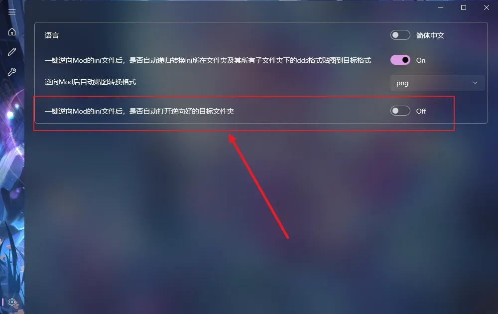

则会弹出一个提示，此功能诞生的原因是大批量Mod逆向时，会弹出超多文件夹导致桌面混乱，
而如果什么都不提示，又很容易让人心里没底，因为看不到什么时候成功，逆向需要3到5秒，可能会因为没有成功提示多等很长时间。

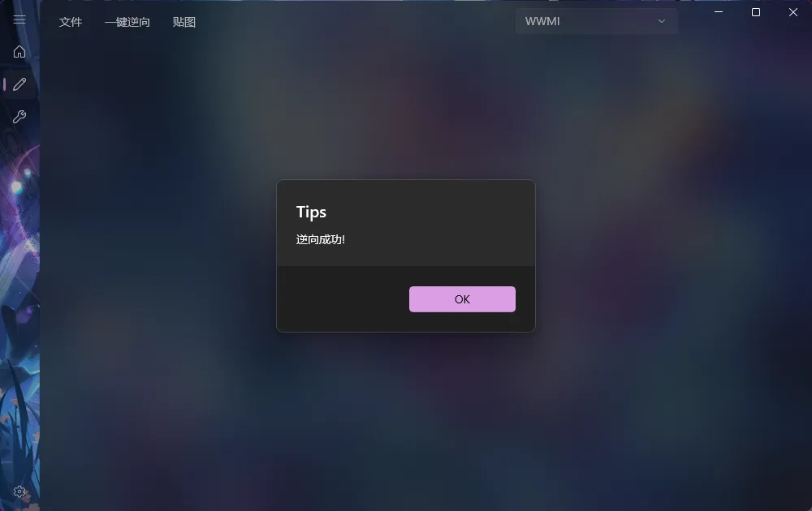

总之此版本解决了这个问题。。
另外手动逆向现在也同样适用于这个机制了。。

# V1.0.5.4

## 1.鸣潮一键逆向出来的模型文件名称变更
现在鸣潮Mod逆向出来，会自动把各个拆分的小部位的名称后面加上_IndexCount_IndexOffset
第一个数字是绘制索引数，第二个数字是索引偏移值，如下图

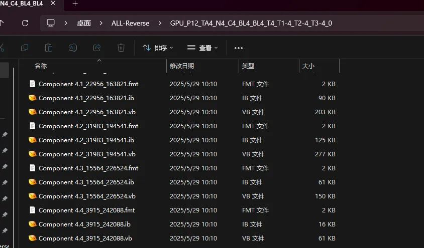

正好可以跟ini中drawindexed = 的用法的顺序对的上，这样就能直观的感受到每个部位的模型是哪一个drawindexed = 逆向出来的。
而同时，一般良好习惯的Mod作者都会有规律的重命名各个模型的名称，这就会导致Mod的ini文件里，都会给drawindexed = 添加上对应的注释，如下图：

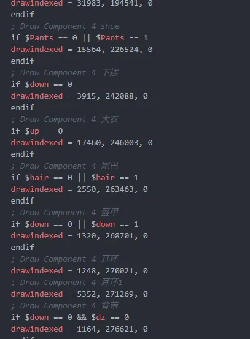

这样我们就可以对照ini，快速的根据注释知道我们逆向出来的每个部位是什么内容，在进行Mod修复时，能够更加灵活方便。

## 2.鸣潮一键逆向按钮名称变更
我们之前的按钮是这样的：

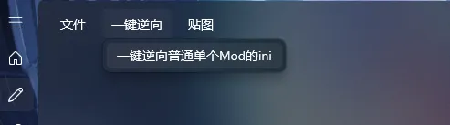

由于其它游戏都有三个逆向按钮，鸣潮只有一个会给人一种混淆的感觉，错认为这个只能逆向普通单个Mod的ini而不能逆向多个drawindexed类型的。
所以对名称进行了修改，改为如下不含有歧义的名称：

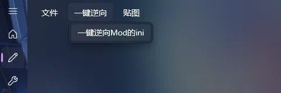

英文对应：

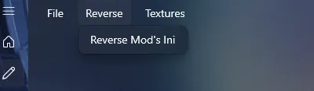

# V1.0.5.3
- 现在手动逆向之前会提示你上次手动逆向的结果是否需要删除后再进行逆向，点是则清除Reversed文件夹下所有内容并继续逆向，点否则直接进行逆向不删除历史文件。

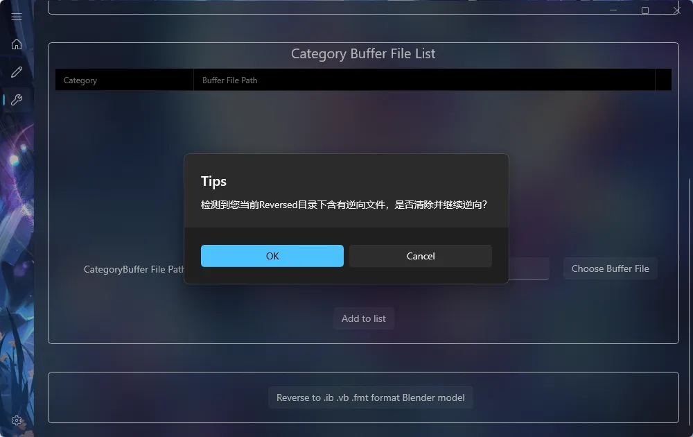

- 新增设置项【一键逆向Mod的ini文件后，是否自动打开逆向好的目标文件夹】，勾选后一键逆向Mod的ini后会自动打开Mod的文件夹，不勾选则只弹出逆向成功的提示：

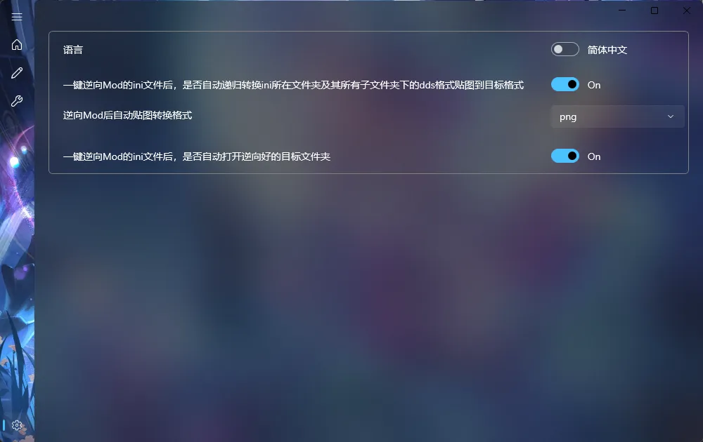

- 现在一键逆向Mod的ini失败后，会自动打开最新的日志文件方便排查错误了。

# V1.0.5.2
- 修复了BLENDINDICES校验对物体Mod总是报错的BUG。
# V1.0.5.1
- 修复了选择游戏那里可以自己填写的问题，因为并不需要自己填写，所以会导致点上去卡一下，现在改成不能填写了，点上去不会有一瞬间的卡顿感了，优化使用体验。
- 优化了手动Mod逆向页面的拖拽流程，现在直接拖拽到列表里就能根据当前选择的Format或Category来新往下增一行啦，用起来更加丝滑流畅。如图所示，黑色部分也可以直接拖拽文件上去：

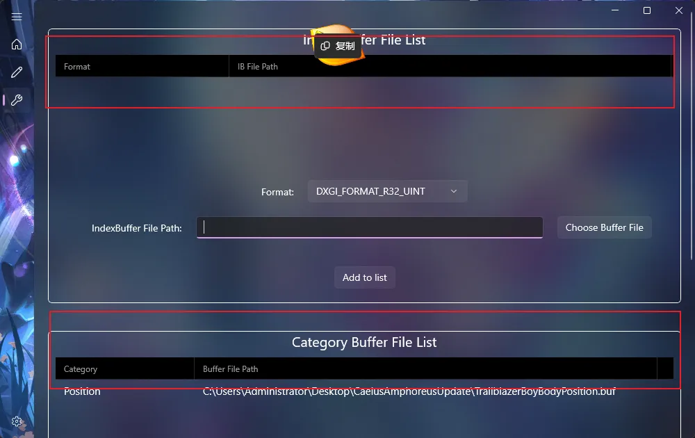

# V1.0.5.0
- 设置页面新增是否在逆向Mod的ini完成后自动转换贴图格式的勾选项配置，勾选后即可节省手动转换贴图的步骤，但是会延长执行速度。
- 设置页面新增逆向完ini后自动转换贴图的格式。
# V1.0.4.9
- 更新了背景图。
- 优化了WWMI一键逆向Mod时的数据类型识别算法。
- 修复了WWMI一键逆向只能识别出一种数据类型的BUG，现在会把识别到的所有可能的数据类型都逆向出来，优先GPU数据类型（也就是说现在支持逆向出WWMI-Tools使用的把Texcoord1当Color1的那个数据类型了，导入Blender即可直接用于WWMI-Tools的Mod制作）。

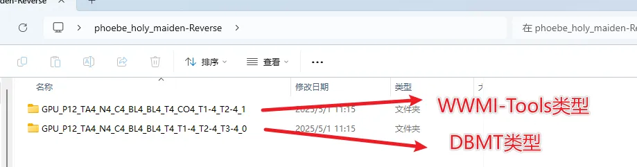

# V1.0.4.8
- 更新了全新的GUI。
- 修复了切换到WWMI后再切换到其它游戏时，无法显示另外两个逆向按钮的BUG。
- Mod手动逆向从DBMT中迁移过来了。
# V1.0.4.7
- 算法优化：添加了部分数据类型的BLENDINDICES校验，减少导入Blender中卡死的几率。(修复了 ZZZ的大猫猫的Mod使用一键逆向DrawIndexed逆向出来，同个数据类型存在两个文件夹，此时其中一个错误的中的模型导入Blender会导致Blender卡死的问题)。
# V1.0.4.6
- 切换到WWMI游戏时，现在只会显示一键逆向普通单个Mod的ini了，因为对于WWMI来说另外两个按钮是无效的。
- 添加了贴图批量转换功能，目前可以转换为常用的.jpg .png 或 .tga格式。
# V1.0.4.5
- 添加了对DrawIndexed = Skip的解析。
# V1.0.4.4
- 更新了崩铁3.2版本之后格式Mod的逆向支持。
# V1.0.4.3
- 添加了图标
- 修复了点击逆向选择ini文件后如果啥都不选会错误弹出无意义提示的BUG。
# V1.0.4.2-2
- 更新了文档链接的地址，现在3Dmigoto-Sword-Lv5有了独立的文档链接了。
# V1.0.4.2
- 3Dmigoto-Sword-Lv5有了单独的GUI界面，现已作为独立工具发布。
# V1.0.4.1-2
- 修复了在DBMTV1.1.6.5版本开始无法使用逆向插件的BUG。
- 移除了从Dump文件中逆向提取的功能，因为太少用了，而且最近的Mod越来越复杂，几乎无法从游戏里dump到正确的Buffer内容，所以后面还得靠一键逆向ini。
# V1.0.4.1
- 此版本修复了由于旧的PatchBLENDWEIGHTS处理不当导致的BUG，该BUG会导致Blend槽位中仅存在BLENDINDICES时逆向出来的fmt文件描述错误，现已移除弃用的PatchBLENDWEIGHTS机制，请更新到最新版Catter以支持此特性。（说人话：修复了绝区零扳机武器Mod无法逆向的BUG，但是需要更新Catter到最新版才能支持导入到Blender。）

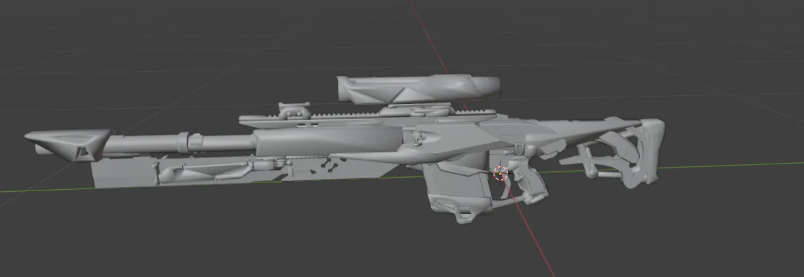

# V1.0.4.0
- 此版本主要更新了一个鸣潮的数据类型，用于兼容WWMI-Tools中含有COLOR1的数据类型（在DBMT正确的数据类型中，WWMI-Tools对应的COLOR1是DBMT的TEXCOORD1）以解决逆向出的模型在使用WWMI-Tools导出时缺失COLOR1，以及生成Mod后轮廓线丢失的问题。
