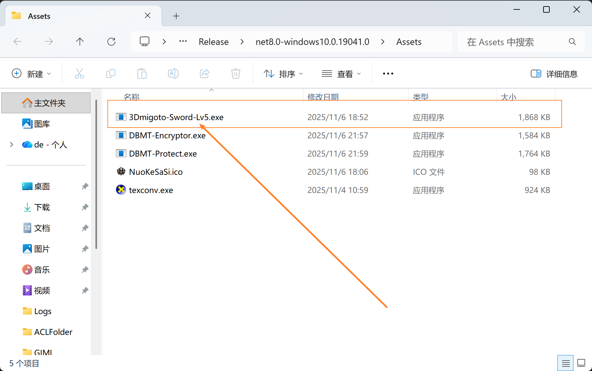
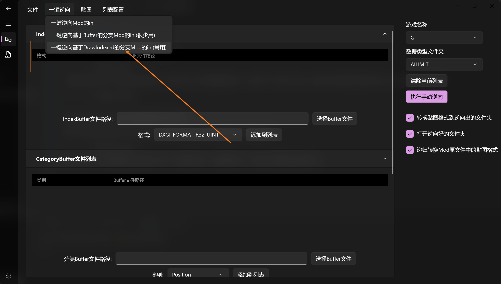
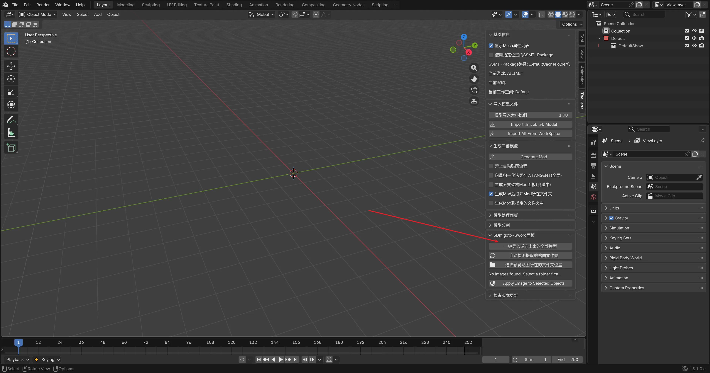

# 激活3Dmigoto-Sword-Lv6插件

赞助后，在爱发电商品附带的自动回复中可以看到SSMT技术社群的群号。

进入SSMT技术社群，在群文件中获取到密钥生成器：

DBMT-KeyGenerator.exe

运行后会闪过一个黑框框，并立刻在原地生成一个当前日期的.key文件，像这样：

随后你把这个日期.key文件发给我，等我有空激活好之后，我就可以把激活后的3Dmigoto-Sword-Lv5.exe发给你了。

# 安装步骤

激活好之后，我会发给你一个名为3Dmigoto-Sword-Lv5.exe的文件

我们打开3Dmigoto-Sword-Lv6，点击【文件】=>【打开Assets文件夹】

随后把3Dmigoto-Sword-Lv5.exe放进去：

然后就能正常使用上面的一键逆向功能了：

# 如何更新版本？

Mod逆向插件持续更新中，新版本可以在群文件中下载获取：

下载其中日期最新的，覆盖Assets目录下旧的插件即可：

# Mod逆向页面基础介绍

文件菜单中可以打开各种文件夹，方便查看配置：

一键逆向菜单中包含了我们的主要的功能，分析Mod的ini并将模型提取出来，点击其中一种分析方式后，弹出的文件选择框中选择Mod的ini文件即可开始自动分析：

逆向成功后会自动打开逆向出来的模型所在的文件夹。

右侧可以选择当前逆向的Mod的游戏类型，在逆向Mod之前必须准确选择对应游戏类型名称：

原神、崩坏三、崩坏星穹铁道、绝区零 有三个一键逆向选项，一般都选第三个，但每个选项都有其独特作用。

鸣潮只有一个一键逆向选项，但适用于所有类型的鸣潮Mod。

如果你会用数据类型，也可以使用手动逆向功能，选择数据类型文件夹，拖拽各种Buffer文件，然后执行手动逆向。

# 一键逆向后如何导入Blender

一键逆向后会自动弹出来逆向好的Mod文件夹：

里面包含了逆向好的模型以及转换过的贴图。

此时我们打开Blender，点开TheHerta插件的面板，点击【一键导入逆向出来的全部模型】：

稍等过后，全部模型都被导入成功了：

# 逆向出来的Mod模型如何上贴图

手动在Shading中上贴图已经过时了，我们Mod逆向成功，导入模型到Blender之后

可以通过插件的功能非常方便的快速上贴图，首先我们切换到材质模式。

选中要上贴图的模型，在下方点击 【Apply Image to Selected Objects】即可将贴图列表中的贴图，快速贴上显示：

嗯，可以看到这里上贴图之后，整个都是错误的，且有很多小纹路，这是因为数据类型不正确导致的。

在下一节内容中我们将讨论数据类型问题，在本节中我们主要演示自动上贴图的步骤。

这里需要注意的是，这里的贴图是Mod逆向后打开的文件夹中被转换好的贴图。

上贴图我们一般只上一个Diffuse贴图就够用了，如果你需要用到其他的贴图，那么最好还是手动上比较好。

这个自动上贴图功能的目的就是为了快速上DiffuseMap贴图，方便显示，因为在Mod制作流程中一般只需要上这个DiffuseMap贴图。

值得一提的是你可以同时选中多个模型来给他们快速上相同的贴图，操作步骤也是一样的。

# 排除并筛选正确的数据类型

在上一节中，我们快速上贴图之后发现贴图不对：

这是由于数据类型不正确导致的，我们的Mod逆向会全自动分析Buffer文件所有可能的数据类型，并且全部逆向出来，以此确保没有遗漏。

现在我们回头再看看之前逆向出来的文件夹：

可以看到里面有多个子文件夹，每个子文件夹的名称，都是以8位数的Hash值，加上下划线，加上数据类型名称构成的。

这里的每个Hash值，在3Dmigoto的Mod中代表一个基础Mod修改单位，可以简单的理解为一个模型集合。

此时每个模型集合被Mod逆向自动分析出了多个数据类型，所以你可以看到这里的文件夹有三个相同Hash值为前缀的但是后面数据类型名称不同的文件夹。

这里虽然有多个数据类型，但是其中只有一个数据类型是正确的，所以我们需要排除错误的数据类型，只保留正确的，首先我们回到Blender，观看导入Blender后的集合结构：

可以看到每个白色的集合都是一个逆向出来的子文件夹名称，此时我们只需要删除掉错误的数据类型名称的集合，就能排除掉错误的数据类型的模型了，那么如何分辨数据类型是否错误呢？还记得我们刚才快速上贴图的结果吗？

此时可以打开UV查看是否正确：

可以看到UV整个都炸了，说明这个数据类型是错误的，所以我们要删除这个错误的数据类型集合：

这样对于9e396d3e来说就还有两个数据类型了，我们继续检查UV：

发现上面那个的第二个UV是错误的，下面数据类型则全部UV都是正确的：

所以排除上面的数据类型，最后只剩下一个正确的数据类型：

此时自动上贴图的结果就正确了。

下面的a702451c也是同理，删掉UV中错误的数据类型。

最后得到的结果就可以直接使用了。

