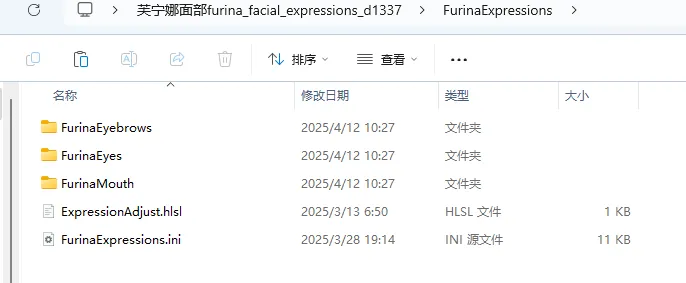
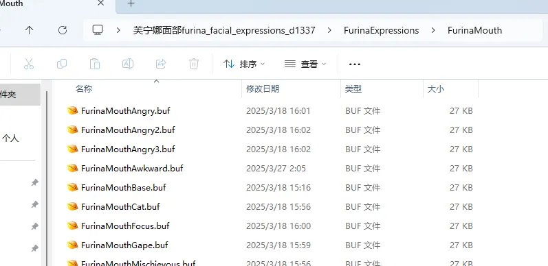
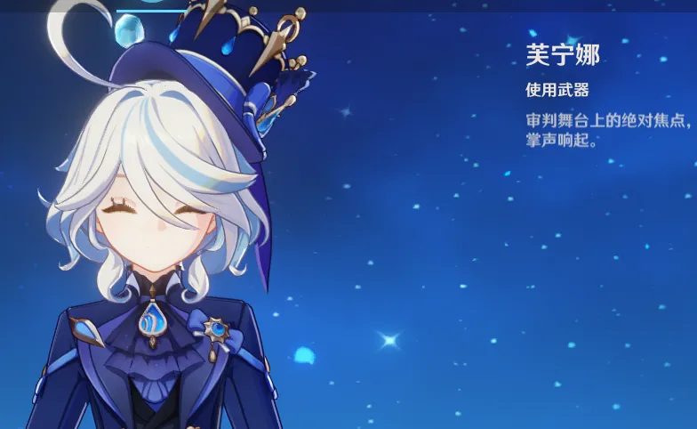

首先以一个芙宁娜的Mod为例，这是文件结构：





可以看到，这个Mod是给芙芙添加了不同的表情，且按键可以切换：



原理是使用了CustomShader通过顶点偏移来模拟表情的形态键：
```
struct vb0 {
    float3 position; 	// 12
    float3 normal; 		// 24
	float4 tangent;		// 40
};

RWStructuredBuffer<vb0> rw_buffer : register(u1);
StructuredBuffer<vb0> base : register(t0);
StructuredBuffer<vb0> key : register(t1);

Texture1D<float4> IniParams : register(t120);

[numthreads(1, 1, 1)]
void main(uint3 DTid : SV_DispatchThreadID)
{
    rw_buffer[DTid.x].position += key[DTid.x].position - base[DTid.x].position;
}
```

此时所有的.buf文件都是Position分类的数据，并且和游戏中原本脸部的Position数据仅有POSITION、NORMAL、TANGENT的位置不同。

逆向步骤如下：

1.去游戏里提取脸部三个部位的原模型，以此来获取它们的ib文件。

2.改写fmt文件，仅保留POSITION，NORMAL，TANGENT三个元素。

3.Mod里的.buf文件改名为.vb文件

4.用刚才得到的.ib .fmt .vb文件放在一起，它就是一个可以被导入到Blender中的模型了。


