SSMT 不严格要求 Blender 版本，最低支持 [Blender 3.6 LTS](https://www.blender.org/download/lts/3-6/#versions)，推荐使用 [Blender 4.2 LTS](https://www.blender.org/download/lts/4-2/#versions) 或更新的版本。

# SSMT 的 Blender 插件安装教程

前往 [GitHub 仓库](https://github.com/StarBobis/TheHerta)，仿照 SSMT 安装教程，下载 Release 中的最新插件版本到任选位置：

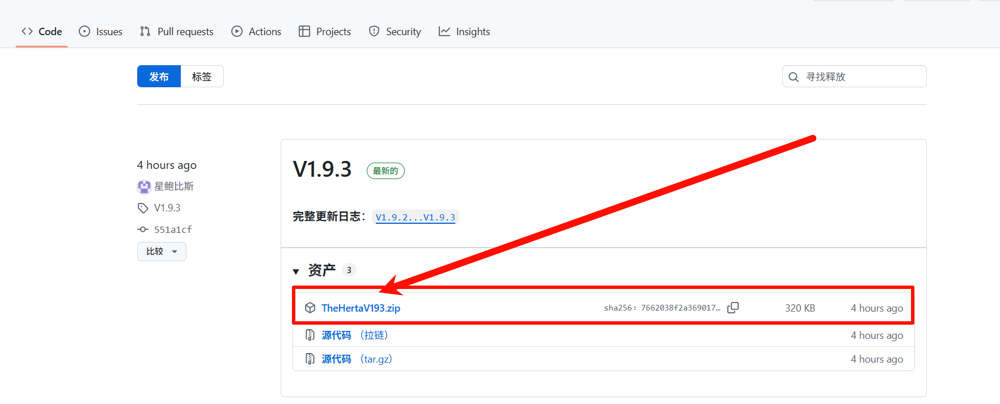

下面将分别以采用简体中文界面的 Blender 4.2.9 和 3.6.23 为例示范。

## Blender 4.2.9

1. `编辑` → `偏好设置`：

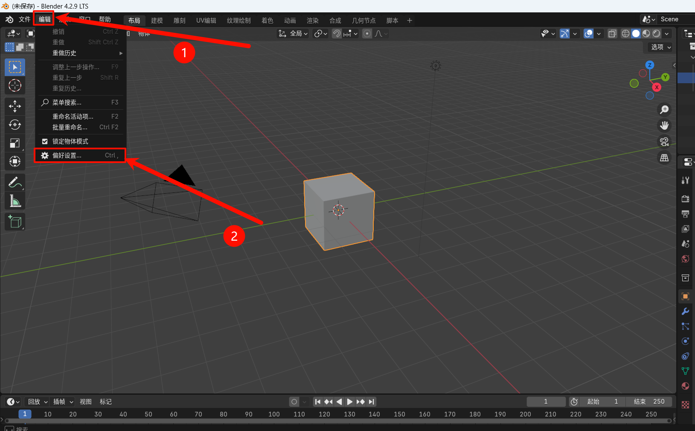

2. 弹出窗口，`插件` → `v` → `从磁盘安装`：

3. 弹出菜单，类似文件资源管理器，选择下载好的 `TheHertaVxxx.zip`，然后点击 `从磁盘安装` 确认：

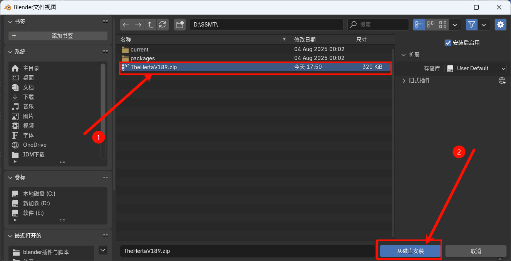

4. 此时安装成功，关闭偏好设置窗口，可以按 `n` 打开侧栏，能够看到 `TheHerta` 项：

## Blender 3.6.23

1. 同前，打开偏好设置；

2. `插件` → `安装`：

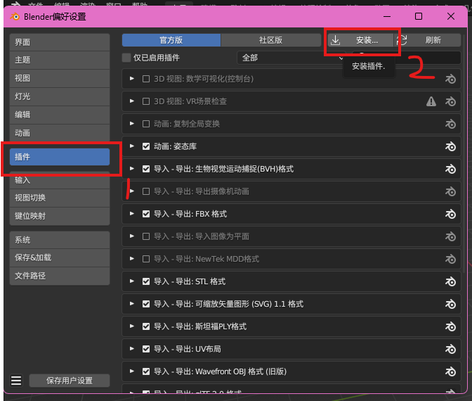

3. 同前，选择并确认安装；

4. 选择 `社区版`，查看社区版插件，安装好插件后，3.6 版本 Blender 不会自动启用，在这里勾选启用，然后保存配置即可。如果不小心在此时关闭导致无法找到插件，点击 `社区版`，然后在绿框处搜索 “SSMT” 即可：

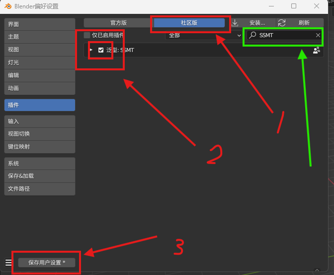

5. 其余验证工作同前。

# SSMT 插件更新

在侧栏打开 TheHerta 工作菜单，点击 `检查 ssmt_blender_plugin 更新`，等待片刻：

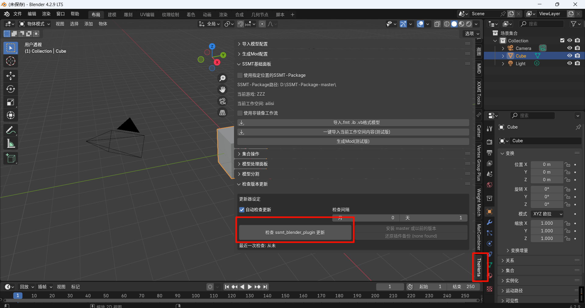
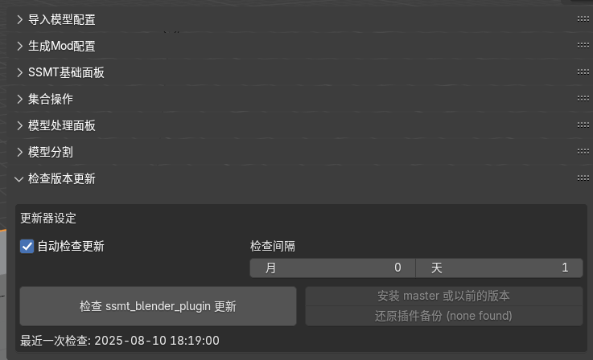

若有更新，点击 `Update Now to (x.x.x)` 即可：

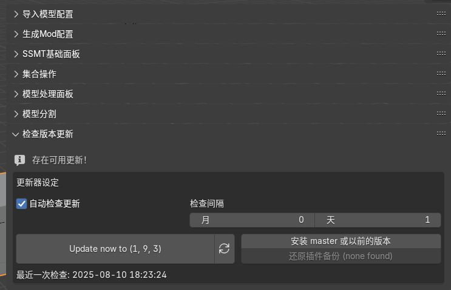

重启 Blender 以完成更新：

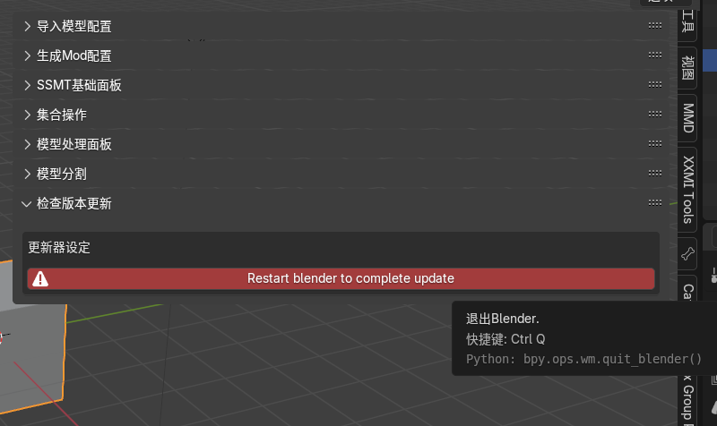

<!-- 下载完成后，我们就可以进行安装了：

注意，以下内容使用的是SSMT的旧版本Herta插件作为演示，实际安装过程中，要使用我们的SSMT插件：

(1) 编辑菜单中选择偏好设置：

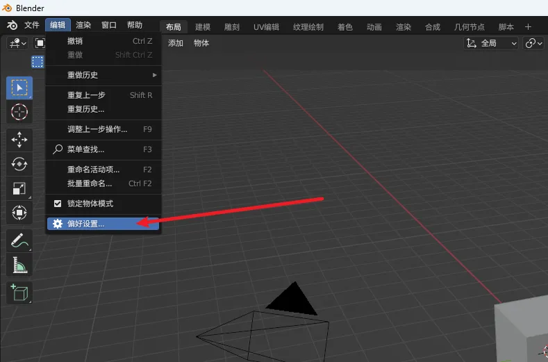

(2) 选择插件，点击安装：

上图为3.6的界面，如果是4.2的界面是下面这样的：

(3) 弹出的对话框选择我们打包好的zip文件，然后点击安装插件

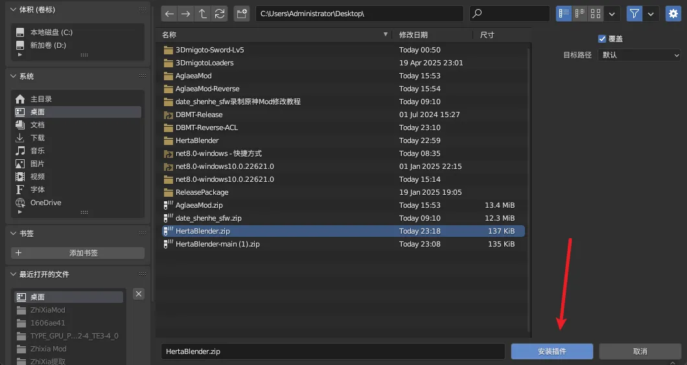

(4) 安装后，在插件栏中搜索Herta，并勾选启用：

勾选后变成这样展开的形式：

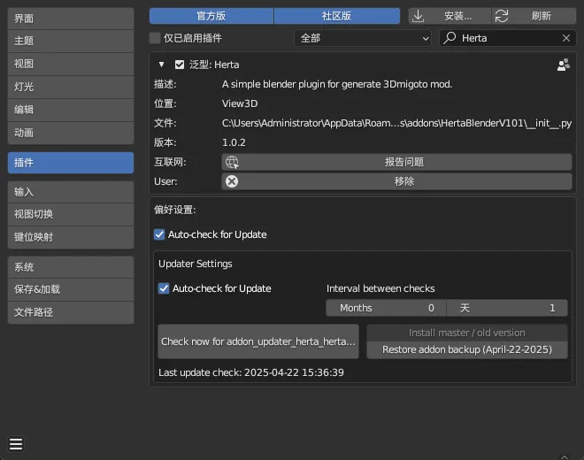

(5) 接下来就可以关闭插件界面了，随后在侧边栏可以看到一个名为Herta的面板按钮：

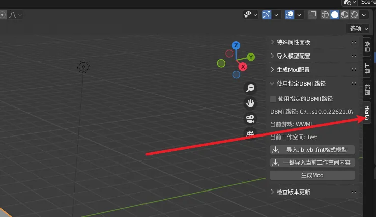

到这里安装就完成了，可以使用了。 -->