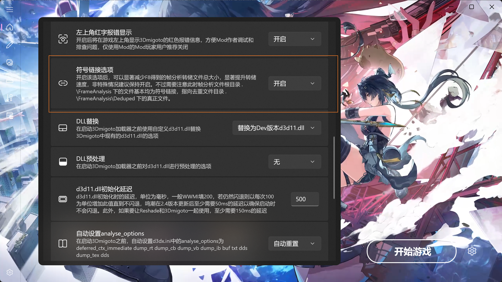

# 🚨 提取模型时提示“找不到数据类型”？别慌！💡

嘿，Mod 制作人们！👋 在使用 SSMT3 提取模型时，如果弹出了 **“找不到数据类型”** 的提示，先别急着抓狂！这篇指南就是为你准备的救火手册！🚒

## 🔍 第一步：侦探模式开启！

当报错出现时，我们先来做个简单的自我检查：

1.  **📋 查阅运行日志**
    *   日志是不会撒谎的！很多时候，报错提示“找不到数据类型”，其实是因为 **游戏预设 (Game Preset)** 选错了。
    *   仔细看看日志里的详细信息，说不定答案就藏在里面哦！

2.  **🤔 真的缺数据类型吗？**
    *   如果日志里确实没有明显的配置错误，那可能真的是遇到了新的数据结构。这时候就需要你协助我来添加啦！

---

## 📦 第二步：准备 FrameAnalysis 文件 (Dump)

为了让我能分析出新的数据类型，你需要把游戏运行时的 **FrameAnalysis** 数据发给我。但是，这个文件夹通常超级大！😱

### ⚡ 瘦身秘籍：如何让 Dump 文件变小？

在按下 `F8` 进行 Dump 之前，请务必尝试以下操作：

*   **🎯 减少 IB 总数 (关键！)**
    *   屏幕上渲染的东西越少，IB 就越少，Dump 出来的文件就越小，速度也越快！
    *   **操作技巧**：
        1.  按下 **小键盘 `+` 号**，把绿字界面还原到初始状态。
        2.  **抬头看天** ☁️，或者找个角落，让视野里 **只有** 你想提取的那个模型。
        3.  尽量避开复杂的场景和特效。

*   **🔗 开启 Symlink (强烈推荐)**
    *   这个功能是神器！能显著减少文件体积并提升速度。一定要开！
    *   

*   **🎛️ 指定 IB 列表 Dump (进阶)**
    *   如果你是老手，开启这个功能只 Dump 目标 IB，文件会非常小。
    *   如果是萌新，Dump 完整的也没关系，只要记得“抬头看天”就好！

---

## 🛠️ 第三步：打包发送给我 📨

准备好数据后，请按照以下步骤打包发给我：

### 1. 📂 找到 FrameAnalysis 文件夹
点击 SSMT3 界面上的 **“打开 3Dmigoto 文件夹”**。

你会看到 `FrameAnalysis` 文件夹：

### 2. 📦 压缩最新的一次 Dump
找到里面 **时间最新** 的那个文件夹（对应你刚刚提取失败的那次），把它压缩成 `.zip` 格式。

### 3. 📤 别忘了 IB 列表
回到 SSMT3 工作台，把提取出来的所有 `IB` 列表也一起发给我。

### 4. 📝 附上关键信息
发送给我时，请备注：
*   🎮 **游戏名称**（是原神、星铁还是绝区零？）
*   🖼️ **模型描述**（比如：这是“流萤”的头发）
*   📦 **压缩包**（建议使用 **QQ 闪传**，因为文件可能很大！）

> ⚠️ **重要提醒**：
> *   **不要** 擅自删除 FrameAnalysis 文件夹里的文件来“减重”，这会导致数据损坏！
> *   如果文件实在太大传不了，可以直接告诉我模型在游戏里的 **具体位置** 和 **名字**，我可以尝试自己去游戏里复现（虽然我不怎么玩游戏，但我会努力试试！😤）。

---

## 🤓 极客时间：自己动手添加？

如果你是硬核玩家，想挑战自己：
*   你可以在 **数据类型管理页面** 尝试手动添加。
*   虽然暂时没有详细教程，但你可以通过阅读 **SSMT 源码** 来参悟数据类型的奥秘... 🧘‍♂️ (祝你好运！)

---

希望这篇指南能帮到你！坐等你的投喂，我会尽快更新数据类型的！🚀

