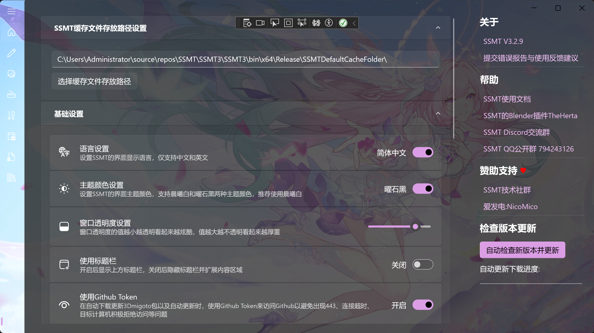
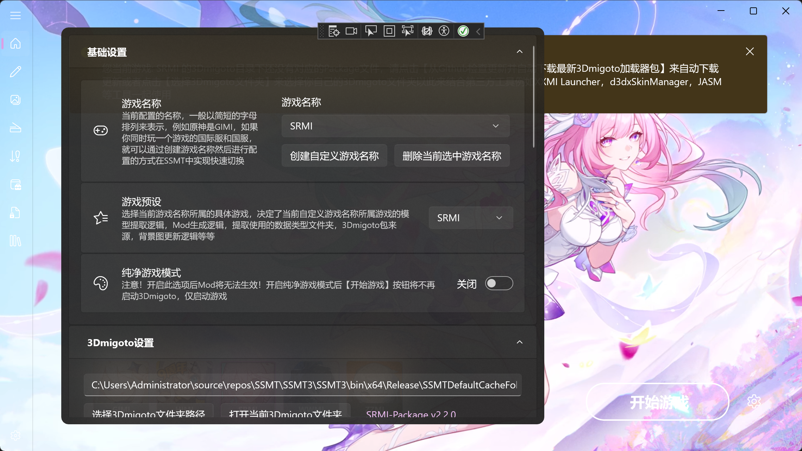
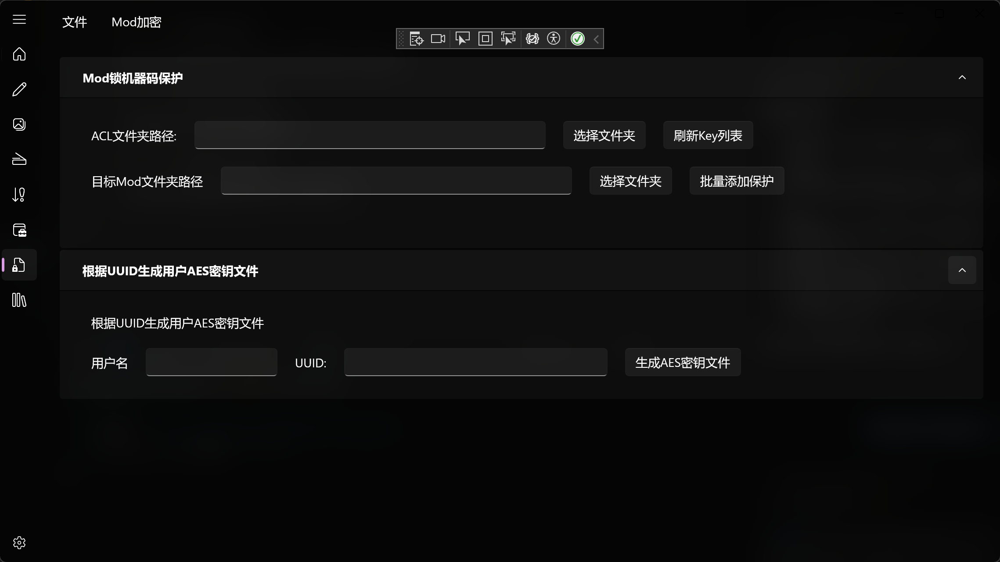
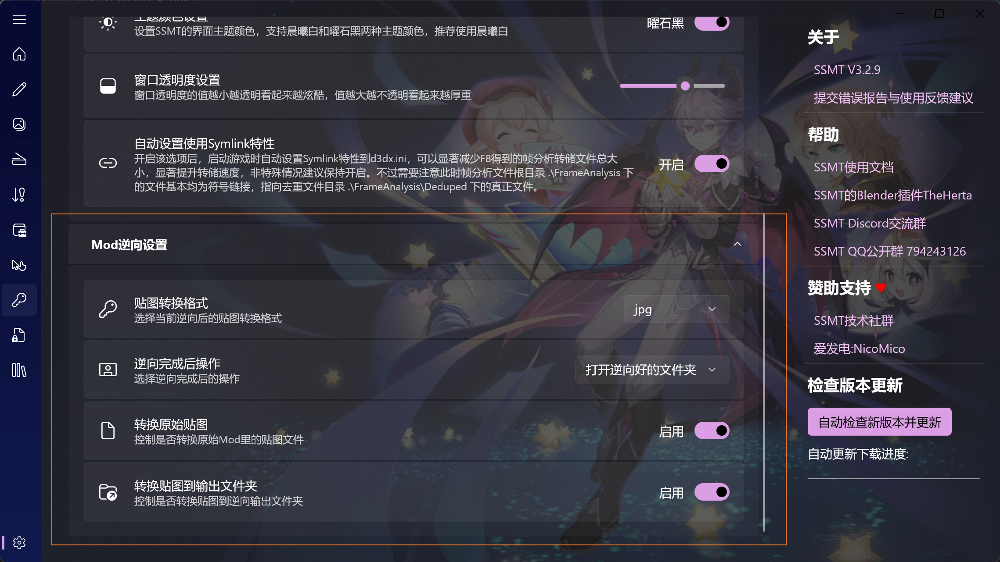
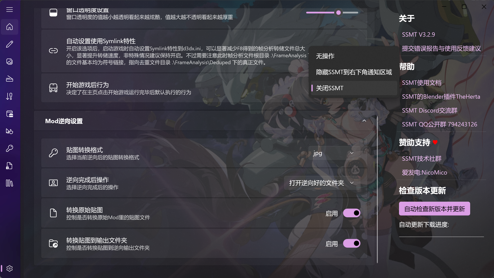

# 📢 提示

::: info 📝 发布规则变更
**V3.2.8** 之后的 **SSMT** 在Mega网盘中更新，不再公开到Github，不再发布到国内任何平台:

https://mega.nz/folder/9md3xBYL#yARidR87zgWhBGVCx_m7WQ

:::

## V3.3.6
- 更新了Dev版本的d3d11.dll，提高了默认的VertexLimitRaise的顶点数，防止部分年久失修的古董Mod无法完整显示。
- 修复了崩铁提取逻辑的一个严重BUG，该BUG会导致填写多个DrawIB时，所有DrawIB都无法正确识别数据类型。

## V3.3.5
- 优化主页布局，背景图和图标相关设置移动到最上面，现在只有GIMI会显示其它设置那一栏的东西了，防止视觉干扰。
- 修复了贴图标记页面中，如果Component1和2的PS的Hash值相同，标记1时不会自动标记2的BUG。

## 🔧 V3.3.4

::: warning 🐛 BUG 修复
- 🏷️ 修复了 **贴图标记** 的一个 BUG：当不同 `DrawCall` 使用相同的贴图但槽位不同时，若已标记过前面的 `DrawCall`，后续 `DrawCall` 的标记结果会错误地应用第一次出现的 `DrawCall` 的标记结果。
- 🚫 修复了部分情况下 **原神** 出现 `10010-4001` 报错的问题。
:::

## 🌈 V3.3.3

::: tip ✨ 更新亮点
- 🆕 更新了 `ZZMI` 和 `SnowBreak` 的一些 **数据类型**。
- 🔧 修复了 `指定IB列表Dump` 功能无法使用 **Symlink特性**，导致 Dump 出来内容在部分情况下反而不如仅开启 Symlink 特性 Dump 出来小的问题。
:::

::: details 🛠️ 详细改进
- 📂 **工作台页面** 中，将频繁使用的 `打开当前生成Mod的文件夹` 从左上角移动到了 **右侧侧边栏**，更加方便。
- 🗑️ 移除了 `数据类型管理` 页面的 **缓存功能**，修复了切换游戏时，数据类型文件夹下拉列表无法得到更新的 **BUG**。
- 💾 `数据类型管理` 页面新增 **离开页面时保存当前填写的内容**，以及 **进入页面时读取上一次保存的内容**。在频繁测试切换页面时，不用再担心 **数据丢失** 的问题了。
- 🖱️ `数据类型管理` 页面的列表，新增右键菜单 `复制此行内容并添加在最底部` 和 `复制此行内容并添加在下一行`，在需要频繁添加重复行的场景，更加 **快捷方便**。
- 🌐 `数据类型管理` 页面完善了 **双语支持**。
- 📜 修复了 **一键逆向功能** 执行出错时，只弹出对话框，不弹出 **运行日志** 的 BUG。现在运行出错会直接帮你打开 **最新的逆向运行日志**。
- 🐛 修复 **Mod管理页面** Mod 项被双击时可能出现的 **BUG**。
:::

## 🚀 V3.3.2

::: tip 🎨 视觉优化
- 🖼️ 优化了 **主页页面** 的显示效果。
- ⚖️ 主页同一行内可显示的图标数量由 **6个** 改为 **5个**，避免打破 **视觉平衡**。
:::

::: warning 🐛 BUG 修复
- 🔄 修复了主页中 **游戏切换** 时，如果切换到未设置背景图的游戏会导致当前背景图显示为 **上一个游戏** 的 BUG。
:::

## 🛠️ V3.3.1

::: danger 🚨 紧急修复
- 🐛 修复了 `贴图工具箱` 页面，无法正常生成 **动态贴图Mod** 的 BUG。
- 💥 修复了 `贴图工具箱` 页面，`原始贴图文件` 和 `视频文件` 接受拖拽时，会直接导致 **SSMT闪退** 的 BUG。
:::

## 🎉 V3.3.0

::: tip 🌟 核心更新
- 🛠️ 修复了 **工作台** 页面的 **当前Dump模式** 无法记忆，导致离开页面后，返回页面时显示状态和实际状态不同步的 BUG。
- 🎨 **贴图工具箱** 页面有了全新的 **背景效果**。
- ✨ **贴图工具箱** 页面新增 **垂直翻转** 和 **水平翻转** 两个控制选项。
:::

::: details 🐛 修复与优化
- 🐛 修复了 **贴图标记** 页面中，当多个 `DrawIB`，或者同一个 `DrawIB` 的多个 `Component` 使用同一个 `Pixel Shader` (即 PS 值相同) 时，标记其中一个 `Component` 不会让其它 `Component` 也自动标记好，或标记其中一个 `DrawIB` 不会让其它 `DrawIB` 也自动标记好的 BUG。
- 🩹 修复了打开 **贴图标记** 页面后，在不手动更换当前选中的 `DrawIB` 的情况下，当前 `DrawIB` 上方并不会显示当前 `DrawIB` 的别名的 BUG。
- 🎞️ 优化了切换 **动态视频背景** 时显示的视觉效果。
- 🔇 修复了 **主页背景视频** 可以播放声音的 BUG。
- 🔄 修复了主页点击 **检查背景图更新** 时，不会删掉已有的 **旧背景图**，造成切换游戏后旧的背景图视频仍然生效的 BUG。
- ⚡ **Mod管理页面**，现在 **新增的Mod** 默认是 **开启状态** 了，添加完游戏里直接 **F10** 刷新就能看效果。
:::

## 🎄 V3.2.9

::: info 🖼️ 全新视觉体验
- ✨ **设置页面** 拥有了全新的视觉效果，现在可以透过背景直接看到背景图：

- 👻 **主页配置卡片** 现在是半透明的了：

:::

::: tip 🧩 插件与功能回归
- 🔒 **Mod加密** 与 **锁机器码** 现在回归 **SSMT本体** 中了，安装对应插件后即可使用，不再集成在 `3Dmigoto-Sword-Lv6` 中：

- 🔄 **Mod逆向** 的 `手动逆向` 和 `全自动一键逆向` 现在全部回归 **SSMT本体** 了，插件安装到 `Plugins` 目录下即可使用，和之前一样。
:::

::: details ⚙️ 设置与优化
- 🐛 修复了 **侧边导航栏** 展开后显示在页面内容下方的 BUG：
  
- ✅ 设置页面的 `自动设置使用Symlink特性` 改为 **默认开启**。
- 🗑️ 移除了设置页面的 `贴图工具箱页面显示设置`, `数据类型管理页面显示设置`, `Mod管理页面显示设置` 等无用选项，现在所有页面都是 **默认可见** 的。
- 🚫 移除了设置页面的 `使用标题栏` 开关，默认 **不显示标题栏**。
- 🎅 更新了全新的 **SSMT图标**，圣诞快乐！
- 📂 现在可以在 `自动逆向` 页面中的 **文件** 菜单中 **打开Plugins文件夹** 以及 **打开最新的运行日志文件** 了，更方便排查问题。
- ❌ 移除了 `手动逆向` 页面中的 **打开Asset文件夹选项**。
- 🔑 移除了 `设置页面` 中设置 **Github Token** 的选项，同时改善了用户 **自动更新** 的体验。
- ⚠️ 现在 `自动逆向` 如果检测到不存在逆向插件，则会弹出窗口提示是否跳转到 **赞助获取页面**。
- ⚙️ 设置页面新增一些 **Mod逆向** 的可配置选项：
  
- 💾 现在 `手动逆向` 页面里的内容是 **可记忆** 的了，不会出现离开页面后里面的内容丢失的问题了。
- 🗑️ 移除了 `手动逆向` 页面里的 `列表配置` 菜单，及其下面的 `保存当前所有列表内容` 和 `读取上次保存的列表内容` 选项，因为现在进入页面时自动读取配置，离开页面时自动保存配置，无需人工考虑了。
- 📝 优化了 **手动逆向页面** 的布局，现在不会导致文本框的标题文字在一般情况下显示不完全的问题了。
- 🎮 设置页面新增 `开始游戏后行为`，现在可以在开始游戏后 **自动关掉SSMT** 或者 **自动把SSMT隐藏到右下角通知区域** 里了。
  
- ⏱️ 更新了 `LOD.exe`，现在可以读取 `delay` 参数来决定几秒后自动关闭 `LOD.exe` 了，**-1** 即为不关闭，**0** 或以下的值会被默认视为 **5**，**0** 以上的值可自由填写，单位为秒。
- ⏳ 主页设置新增 `注入程序自动退出时间`，默认值为 **5**，可决定 `LOD.exe` 注入完成后几秒再自动关闭自己。
- ♻️ `Mod管理页面` 中删除 Mod 现在会移动到 **回收站** 而不是彻底删除了，防止意外点击丢失数据。
- 🎞️ 进一步优化了 **动态背景视频** 防止卡顿。
- 🖼️ `Mod管理页面` 现在能看到主页的 **背景图** 了。
- 👤 设置页面新增 `玩家模式`，开启后导航栏仅显示 `主页`, `Mod管理页面`, `SSMT文档`, `设置页面`。
- 🆔 **SSMT** 在任务栏中显示为 `SSMT3`，不会和旧版本共用一个位置导致同时使用时分不清楚了。
:::