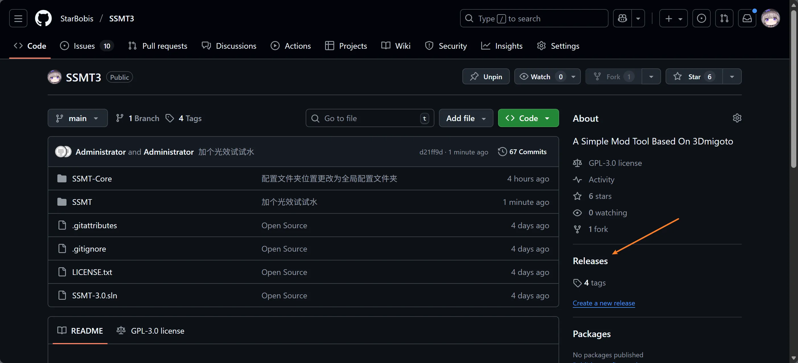
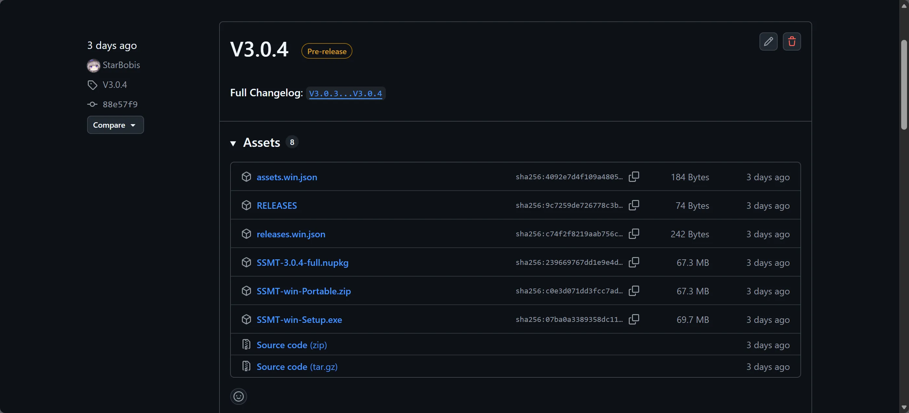

# 🚀 SSMT3 下载与安装指南

欢迎来到 **SSMT3** 的世界！这款基于 **3Dmigoto** 的模型提取与 Mod 制作工具箱，将为你带来无限创意可能。🎨

## ⚙️ 推荐配置

- 💻 **系统兼容**：Windows 11
- 🔧 **运行环境**：需要安装 **.NET 8.0** 运行时环境，一般Windows系统已预装。
- 💾 **磁盘建议**： 预留至少 **200G** 空闲空间的**固态硬盘 (SSD)** 上。
- 🛡️ **安全设置**：请先关闭微软的 **Smart Screen**，防止无法启动3Dmigoto注入器。设置路径：设置 → 隐私和安全性 → Windows 安全中心 → 应用和浏览器控制 → 基于声誉的保护设置。

## 📥 1. 从 GitHub 下载 SSMT 的压缩包

前往以下链接下载最新版本的 **SSMT3**：

[https://github.com/StarBobis/SSMT3](https://github.com/StarBobis/SSMT3)

> 💡 **小贴士**：你看到这篇文档的时候，也许已经更新了很多版本了，没关系，只要下载最新版的 **zip 文件** 就好了。这里只演示 zip 文件的解压使用，因为只推荐使用 zip 文件的方式安装。

## 📦 2. 下载完成后解压到桌面

## ▶️ 3. 双击运行 SSMT.exe

🎉 到这里就安装完成，可以正常使用了！快去探索 SSMT3 的强大功能吧！
