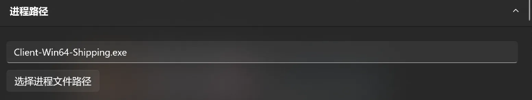

# 主页配置

第一次安装好之后，打开默认是5个游戏：


此时我们可以点击右下角设置按钮来进行具体的配置，配置完毕后才能正常使用

本次演示以原神为例：


游戏名称，就是你自定义的游戏名称，默认自带了一些，你也可以自己创建新的游戏名称。

游戏预设非常重要，每个游戏都有唯一的游戏预设，例如原神选择GIMI。

纯净游戏模式的话，只有特殊需要的人才会开启，一般不会开启。


如图，这里的3Dmigoto路径，第一次安装完毕会默认设置到默认的SSMT缓存文件夹下面

如果你结合其它第三方工具使用，也可以手动选择到对应的3Dmigoto目录

如果你希望下载每个游戏预设推荐的3Dmigoto包，也可以点击如下按钮自动下载：


进程路径就是3Dmigoto要注入到的游戏进程的路径

启动路径就是点击【开始游戏】后，先启动3Dmigoto的注入器，然后再启动的路径

启动参数顾名思义，用到了可以填写


剩余的所有配置，都可以看到具体的介绍和配置方法，这里就不冗余阐述了，多玩几下就会用了。


# 其它游戏配置注意事项

- 二重螺旋，卡拉比丘，尘白禁区的游戏预设都选 SnowBreak即可

其中二重螺旋的游戏路径如下，不要选错了：


此外二重螺旋的收入全部100%来自于皮肤，不建议制作Mod发布，只建议用来制作二创视频


- 原神的游戏预设是GIMI
- 崩坏三的游戏预设是HIMI
- 崩坏：星穹铁道的游戏预设是SRMI
- 绝区零的游戏预设是ZZMI
- 鸣潮的游戏预设是WWMI
- 少女前线2以及其他UnityCPUPreSkinning类型游戏的游戏预设为GF2
- 燕云十六声的游戏预设是YYSLS

燕云十六声的进程路径比较特殊，有时候是r有时候是rh：


游戏启动时，随机选择其中一个进程启动，这导致我们经常填写错误的进程路径导致注入失败。

以如下路径举例：

```
D:\yysls\yysls_medium\Engine\Binaries\Win64r\yysls.exe
```

如果上面的r不对，那就换成rh再走一遍注入流程：

```
D:\yysls\yysls_medium\Engine\Binaries\Win64rh\yysls.exe
```

启动路径不填，因为3Dmigoto只支持DX11，我们需要从官方启动器启动，并且需要勾选DX11选项：


- 鸣潮配置方法注意事项:

游戏预设为WWMI

进程路径只填一个：Client-Win64-Shipping.exe



而且启动路径我们是空着的，因为我们只在SSMT中启动3Dmigoto，不在SSMT中启动游戏。

3Dmigoto用的是WWMI-Package，点击【从Github检查更新并自动下载最新3Dmigoto加载器包】自动下载安装最新版即可。

随后我们打开鸣潮的启动器，勾选DX11启动即可。

- 解限机已ban掉3Dmigoto，后续不再支持：

很显然，解限机是PVP游戏，且卖皮肤，且机甲模型是宝贝，且之前上了高价值模型保护系统。

使用ACE来拦截任何可能的外挂程序。

之前在公测的时候还是可以使用的，但是目前已经无法使用了，所以各位就不要再尝试了。


